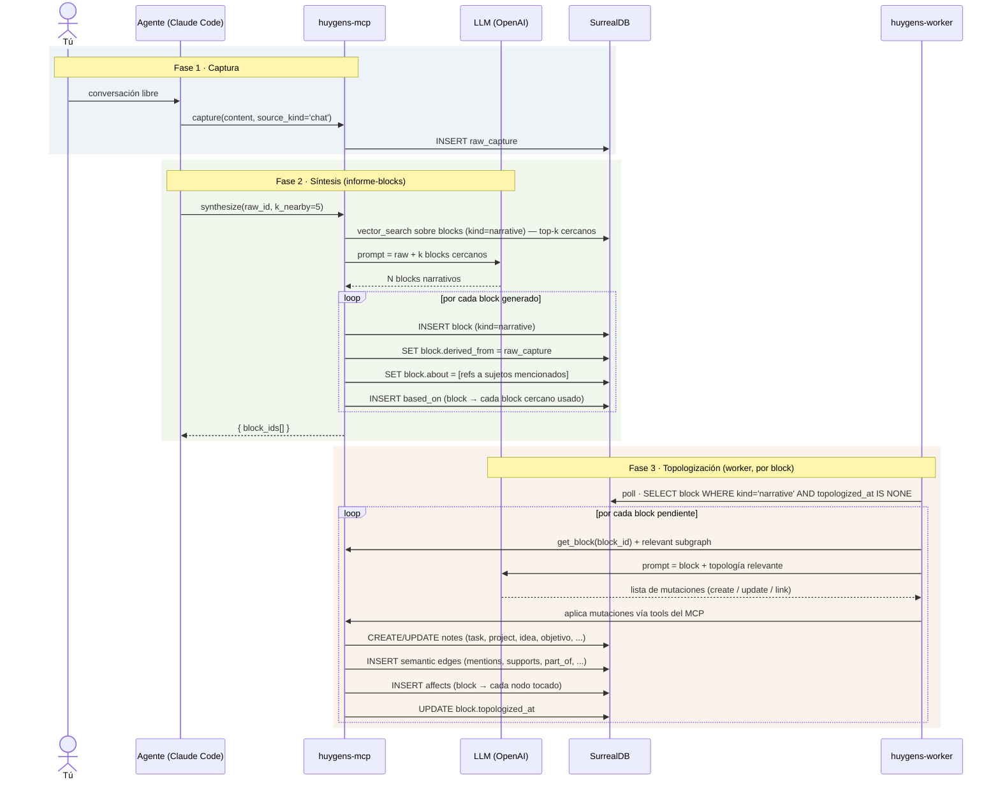

# Huygens — Modelo (v2.1)

> Documento canónico. Reemplaza toda la documentación conceptual anterior, que ha sido eliminada en una pasada de limpieza. Si algún otro doc contradice este, **este gana** hasta que se reescriba el otro.

---

## En una frase

> Hablas con un agente, eso queda registrado como un raw, se sintetiza en informe-blocks pequeños y atómicos, y un worker pequeño aplica lo que dice cada block al grafo (crea o modifica tasks, projects, objetivos, ideas, references).

El block narrativo es el corazón del sistema. Cada uno es un átomo Zettelkasten con su propio linaje (de dónde viene, sobre qué habla, en qué se apoya). Los "informes-página" tradicionales no existen como entidad — se componen dinámicamente como views sobre los blocks por tema y periodo.

---

## El flujo, paso a paso



Hay tres fases claramente diferenciadas. Las dos primeras son **deliberadas** (las inicias tú o tu agente). La tercera es **automática** (el worker la dispara en cuanto detecta blocks narrativos no topologizados).

---

## Actores y responsabilidades

| Actor | Responsabilidad única | Lo que NO hace |
|---|---|---|
| **Tú** | Conversar. Decidir cuándo el agente debe sintetizar. Aprobar/desaprobar resultados. | Editar SurrealQL a mano de forma habitual. Mantener consistencia del grafo. |
| **Agente conversacional** (Claude Code) | Volcar lo conversado al raw. Sintetizar informe-blocks a petición tuya con contexto de blocks cercanos. Servirte de interfaz de consulta al grafo. | Modificar el grafo directamente sin pasar por blocks narrativos. Decidir solo qué entra al grafo. |
| **huygens-mcp** | Exponer tools y resources. Persistir raws/notes/blocks/edges. Búsqueda vectorial. Llamar al LLM para `synthesize` y para `compose_report`. | Tomar decisiones de dominio. Es plomería. |
| **LLM** (OpenAI) | Sintetizar blocks narrativos cuando el MCP llama `synthesize`. Producir lista de mutaciones cuando el worker se lo pide. Componer prosa de view cuando se invoca `compose_report` (opcional). | Persistir nada. Decidir cuándo se le invoca — siempre lo dispara MCP o worker. |
| **huygens-worker** | Leer blocks narrativos no topologizados, traducir su contenido semántico a mutaciones del grafo, aplicarlas. **Es un topologizador, nada más.** | Clarificar raws directamente. Generar blocks narrativos. Decidir cadencia. Crear notas que no vengan de un block narrativo. |
| **SurrealDB** | Persistencia, vector index, audit. | Lógica de dominio. |

El cambio central respecto a versiones anteriores: **el worker ya no es el cerebro y el informe ya no es una página**. El cerebro vive en los blocks narrativos (que TÚ generaste deliberadamente con el agente desde una conversación). El worker solo los aplica al grafo. La "página de informe" es una vista dinámica, no una entidad.

---

## Entidades del schema

Dos tablas estructurales más una de evidencia:

### `raw_capture` — evidencia inmutable

```
raw_capture {
  id,
  content        : string         -- el dump literal de la conversación
  source_kind    : string         -- 'chat' | 'voice' | 'manual' | 'import' | 'agent-self'
  source_ref?    : string         -- url, session id, path, etc.
  created_at     : datetime
}
```

Inmutable. Es la única huella de "qué se dijo literalmente". Nunca se edita; las re-interpretaciones crean nuevos blocks que apuntan al mismo raw vía `derived_from`.

### `note` — entidad topológica tipada

Todo lo que es ENTIDAD del grafo (cosas que ERES, HACES, PERSIGUES, REFERENCIAS) es un `note`. Las 8 tipologías están listadas más abajo.

```
note {
  id,
  type           : record<note_type>   -- referencia a la taxonomía (8 tipos)
  title          : string
  state          : string              -- CLARIFIED (único usado esta fase)
  block_order    : array<record<block>>  -- blocks descriptivos del cuerpo, ordenados
  metadata       : option<object>      -- bag flexible por tipo
  created_at     : datetime
  updated_at     : datetime
}
```

Un `note` típicamente tiene 1-2 blocks descriptivos como cuerpo (su descripción / cuerpo). NO contiene los informe-blocks que hablan sobre ella — esos son blocks libres conectados por `about`.

### `block` — átomo direccionable

Todo lo que es CONTENIDO (descripción de notes O narrativa) es un `block`.

```
block {
  id,
  content         : string
  embedding       : option<vector<f32, 1024>>  -- BGE-M3
  embedding_model : option<string>
  dimensions      : option<int>
  
  block_kind      : 'descriptive' | 'narrative'   -- DECLARA el rol
  
  -- si block_kind = 'descriptive':
  note            : record<note>                   -- el note al que describe
  
  -- si block_kind = 'narrative' (informe-block):
  derived_from?   : record<raw_capture>            -- raw que lo originó
  about?          : array<record<note>>            -- sujetos que toca
  based_on?       : array<record<block>>           -- blocks cercanos usados como contexto
  topologized_at? : datetime                       -- marker del worker
  
  created_at      : datetime
  updated_at      : datetime
}
```

**El campo `block_kind` es load-bearing** — discrimina el rol del block. La validación del schema enforce: si `block_kind='descriptive'` entonces `note` es obligatorio y los fields narrativos vacíos; si `block_kind='narrative'` entonces `note` es opcional (típicamente vacío) y los fields narrativos populados según corresponda.

La búsqueda vectorial se hace SIEMPRE a nivel de block — ambos roles son vectorizables. La diferencia es semántica, no de capacidad.

### `note_type` — taxonomía (8 tipos)

| slug | concepto |
|---|---|
| `task` | acción concreta |
| `project` | outcome multi-paso, contiene tasks |
| `area` | área de responsabilidad continua, no termina |
| `routine` | rutina recurrente (clasificación, sin engine RRULE en esta fase) |
| `person` | persona referenciada |
| `reference` | material externo (URL, libro, paper, vídeo) |
| `objetivo` | meta estratégica |
| `idea` | concepto generativo sin compromiso |

Eliminados respecto a versiones anteriores:
- **`report`** — los informes son ahora blocks narrativos, no notes
- **`note`** (tipo genérico observación) — su utilidad solapaba con block narrativo o con `idea`; sin necesidad de catch-all

---

## Edges

Tres familias funcionales.

### Procedencia (cross-plane)

```
block(kind=narrative)  --derived_from-->  raw_capture
```

Field directo del block. Cualquier block narrativo apunta al raw que lo originó. Tiene `transformation`: `verbatim` | `extracted` | `summarized` | `inferred`. Es la única conexión que cruza desde la capa de interpretación a la capa de evidencia.

### Cadenas de informe-blocks

```
block(kind=narrative)  --based_on-->  block(kind=narrative)
```

Cuando se sintetiza un nuevo informe-block, los blocks cercanos (recuperados por vector similarity) se referencian vía `based_on`. Lleva metadata opcional: `relevance_score`, `reason`.

Esto crea **un grafo temporal-narrativo** dentro de los informe-blocks: cada block construye sobre los anteriores. Auditable.

### Sobre qué habla un informe-block

```
block(kind=narrative)  --about-->  note
```

Multi-edge: un block puede ser sobre varias notes a la vez (un block que toca Govoy, mi-yo-cansado, y la productividad-de-lunes tiene 3 `about`). El agente las identifica al sintetizar.

### Mutaciones de topología

```
block(kind=narrative)  --affects-->  note (cualquier tipo)
```

Cuando el worker topologiza un block narrativo, por cada nodo creado o modificado emite un `affects` desde el block. Lleva:
- `action`: `created` | `updated` | `state_changed` | `linked` | `archived`
- `summary`: una frase explicando el cambio

### Edges semánticos (entre notes, no específicos de block narrativo)

Estos los crea el worker cuando topologiza un block narrativo, según lo que el block dice:

```
note  --mentions-->     note          referencias, relaciona con
note  --supports-->     note          refuerza, evidencia para
note  --refutes-->      note          contradice
note  --part_of-->      note          jerarquía (Project → Task, Area → Project)
note  --blocked_by-->   note          dependencia
note  --authored_by-->  note(person)  autoría
```

El worker decide qué edges semánticos crear entre notes al topologizar un block — proponiendo cómo se relacionan las cosas que el block menciona. Esto es decisión sobre estructura relacional, no sobre tipos: el block ya fija qué se está creando y de qué tipo; el worker solo elabora las conexiones. Es la parte de su trabajo donde más LLM interviene.

---

## El ciclo de vida, contado linealmente

### 1. Conversación → raw

Tú abres Claude Code, charlas con el agente sobre lo que sea — un problema de Govoy, una idea para Huygens, una nota de algo que pasó hoy. En algún momento el agente dice "lo dejo registrado" y llama `capture(content, source_kind='chat')` con el dump literal de los últimos turnos relevantes. Se crea un `raw_capture` inmutable. No pasa nada más.

Puedes capturar varias veces durante una misma sesión. Cada captura es un raw independiente.

### 2. Raw → blocks narrativos (síntesis con contexto)

Cuando consideras que el raw contiene material que merece estructurarse, el agente llama `synthesize(raw_id, k_nearby=5)`:

1. El MCP carga el raw.
2. El MCP hace `vector_search` sobre blocks narrativos existentes, devuelve los top-5 más cercanos.
3. El MCP arma un prompt: "este es el raw + estos son blocks cercanos relacionados; sintetiza N blocks narrativos atómicos que continúen la narrativa".
4. El LLM produce N blocks pequeños (típicamente 2-5 según la riqueza del raw, cada uno cubriendo una idea o vínculo concreto).
5. Por cada block: se crea con `block_kind='narrative'`, `derived_from` al raw, `about` a los sujetos que toca, y `based_on` a los blocks cercanos efectivamente usados.

Los blocks quedan en el grafo, **pero todavía no han impactado la topología**. Su existencia es interesante por sí misma (puedes leerlos, refinarlos, descartarlos), pero no han modificado ningún task/project/idea todavía.

Puedes regenerar la síntesis si no te gusta. Solo cuando das los blocks por buenos, dejas que la fase 3 se dispare.

### 3. Block narrativo → topología (worker, uno a uno)

El worker tiene un poll loop de ~5s sobre blocks con `kind='narrative' AND topologized_at IS NONE`. Cuando ve uno nuevo:

1. Carga el block completo.
2. Carga la **topología relevante** — los nodos que probablemente sean afectados. Vector search del contenido del block contra todas las notes, recuperando, digamos, los 20 más cercanos.
3. Llama al LLM con: "este es el block; este es el subgrafo relevante; produce una lista de mutaciones".
4. El LLM produce algo como (JSON estructurado validable por Pydantic):
   ```
   [
     { action: 'update', target: 'note:govoy-project', changes: { state: 'CLARIFIED' }, reason: 'block content L2' },
     { action: 'create', new_node: { type: 'idea', title: 'Tuesday afternoons reservados' }, edges: [ { kind: 'mentions', target: 'note:govoy-project' } ] }
   ]
   ```
5. El worker aplica cada mutación vía MCP tools.
6. Por cada nodo tocado, crea un `affects` desde el block al nodo.
7. Marca `block.topologized_at = now`.

**Idempotencia**: si el worker se reinicia a media topologización de un block, el `affects` ya emitido le sirve para saber qué ya está hecho. La operación es resumible.

**Inmutabilidad post-topologize**: un block ya topologizado no se re-topologiza. Si decides corregir su interpretación, generas un NUEVO block que apunta al anterior vía `based_on` y dice "corrige X del block anterior". Más ceremonia, pero auditabilidad limpia.

Resultado: tu grafo se ha actualizado. Tasks nuevas existen, projects han movido de estado, ideas se han linkeado a sus contextos. Y existe la huella `affects` que te dice "este block causó estos cambios".

---

## "Report" como vista, no como entidad

Cuando quieras leer "el informe de Govoy en abril", no buscas una entidad — compones una **view**:

```surql
SELECT id, content, created_at, about FROM block 
WHERE block_kind = 'narrative'
  AND about CONTAINS $govoy_id
  AND created_at >= time::parse('2026-04-01T00:00:00Z')
  AND created_at <  time::parse('2026-05-01T00:00:00Z')
ORDER BY created_at;
```

El MCP expone `compose_report(subject_id?, period_start?, period_end?, ...)` que envuelve esta query con opciones de ordenamiento y, opcionalmente, una síntesis prosaica final via LLM si quieres una lectura coherente en lugar de fragmentos concatenados.

**Las queries que esto desbloquea naturalmente**:

```surql
-- Toda la historia narrativa de Govoy
SELECT * FROM block 
WHERE block_kind='narrative' AND about CONTAINS $govoy_id
ORDER BY created_at;

-- Mi pensamiento sobre productividad en mayo
SELECT * FROM block 
WHERE block_kind='narrative' AND about CONTAINS $productividad_id
  AND created_at IN '2026-05'
ORDER BY created_at;

-- Cadena de blocks que se apoyan en este uno
SELECT id, content FROM block 
WHERE id IN (SELECT in FROM based_on WHERE out = $block_id)
RECURSIVE;
```

---

## Por qué este diseño

### Trazabilidad total

Para cualquier nodo del grafo, puedes preguntar "¿de dónde vienes?":
- Sigues `affects` inverso → llegas a un block narrativo.
- Sigues `derived_from` desde el block → ves el raw conversacional original.
- Sigues `based_on` desde el block → ves blocks anteriores que lo influenciaron.
- Sigues `about` desde el block → ves los otros sujetos que cubre.

El árbol completo de "por qué este task existe en mi sistema" es navegable hasta la frase original que dije en una conversación.

### Determinismo en la mutación

El grafo NO se modifica sin un block narrativo que lo motive. Cada cambio tiene su razón documental.

### Compounding semántico al nivel del átomo

Los `based_on` entre blocks crean una **narrativa temporal granular**. Cada vez que sintetizas, no partes de cero — partes de blocks cercanos. Después de 6 meses tendrás cadenas largas de blocks que cuentan una historia coherente sobre cada proyecto/área/objetivo, y que se pueden recomponer como views por tema y periodo.

### Granularidad Zettelkasten

Cada block narrativo es un átomo direccionable, vectorizable, citable. La "página de informe" tradicional desaparece como cárcel — la reemplaza la query compositiva.

---

## Lo que el worker NO hace

- ❌ **NO clarifica raws directamente.** Los raws se convierten en blocks narrativos vía `synthesize`, que dispara el agente.
- ❌ **NO genera blocks narrativos.** Esos los produce el agente conversacional.
- ❌ **NO decide qué tipo es algo.** El LLM al que invoca decide tipos pero está restringido a aplicar lo que el block ya menciona.
- ❌ **NO mantiene cadencias.** No hay RRULE engine.
- ❌ **NO re-topologiza un block ya topologizado.** Si necesitas corregir, se genera un nuevo block.

El worker hace una sola cosa: **leer blocks narrativos nuevos, traducirlos a mutaciones, aplicarlas con audit**.

---

## Lo que está fuera del scope de esta fase

| pieza | estado |
|---|---|
| Estados ACTIVE / WAITING / SOMEDAY / DONE / ARCHIVED | Acepta el schema; solo `CLARIFIED` se usa por defecto. Las transiciones via `affects(action='state_changed')` están permitidas pero no obligatorias. |
| `mit_for` field en notes | Existe en schema, no se popula. Planning es fase posterior. |
| Routines con RRULE engine | `routine` es solo clasificación; no hay dual-loop en el worker. |
| `report_snapshot` para congelar composiciones | Diferido (opción C futura): notes opcionales que apuntan a blocks específicos vía block_order para exportar/compartir. |
| Dashboard | No existe. Sin priorizar. |

---

## Las 6 preguntas operacionales — estado tras el refinamiento v2.1

| pregunta v2 | estado en v2.1 |
|---|---|
| **#1 Cuándo un raw se vuelve informe** | Suavizado — el agente sugiere sintetizar tras conversaciones sustanciales; raws sueltos pueden quedar como evidencia sin block narrativo, sin problema |
| **#2 Cómo se miden "blocks cercanos"** | Vector similarity sobre blocks narrativos existentes, top-k=5 default |
| **#3 Protocolo del worker** | JSON con Pydantic schema, validable, con constraints duros |
| **#4 Edición post-topologize** | Resuelto: blocks topologizados son **inmutables**; cambios via nuevo block con `based_on` |
| **#5 Captures pequeños** | Resuelto: no requieren síntesis. Un capture trivial queda como raw_capture y punto. Si decides estructurarlo después, sintetizas |
| **#6 Ediciones directas de topología** | Permitidas pero registradas en `agent_event` como "manual_override". El block narrativo es el camino canónico, no el único posible |

---

## Glosario rápido

| término | significado |
|---|---|
| **raw** | un `raw_capture`. Lo que se dijo literalmente. Evidencia. |
| **informe-block** / **block narrativo** | un `block` con `block_kind='narrative'`. Átomo de pensamiento sintetizado. El cerebro del sistema. |
| **block descriptivo** | un `block` con `block_kind='descriptive'`. Cuerpo de descripción de un note. |
| **topologizar** | aplicar lo que un block narrativo dice al grafo de notes. Lo hace el worker. |
| **topología** | el grafo de notes + edges semánticos (excluyendo blocks y raws). |
| **report** / **vista de informes** | una composición dinámica (query) de blocks narrativos por sujeto y periodo. No es entidad. |
| **synthesize** | tool del MCP que produce N blocks narrativos desde un raw + blocks cercanos. |
| **compose_report** | tool del MCP que devuelve blocks narrativos filtrados (view, no entidad). |
| **fase 1, 2, 3** | captura, síntesis, topologización. |

---

## Estado de implementación

Para que sepas qué hay que tocar:

| pieza | hoy | objetivo del modelo v2.1 |
|---|---|---|
| `capture` tool | ✅ existe | igual |
| `raw_capture` tabla | ✅ existe | igual |
| `note` tabla | ✅ existe (10 types) | **reducir** a 8 types — eliminar `report`, eliminar `note` (type genérico) |
| `block` tabla | ✅ existe | **extender**: añadir `block_kind`, hacer `note` opcional, añadir `about`/`based_on`/`derived_from`/`topologized_at` (como fields y/o edges según convenga) |
| `synthesize` tool | ❌ falta (existe `generate_report` que produce note completo) | **adaptar**: produce N blocks narrativos, no un note wrapper |
| `compose_report` tool | ❌ falta | **añadir**: returns ordered blocks via query, no persiste |
| `based_on` edge | ❌ falta | **añadir**: relation block → block |
| `affects` edge | ❌ falta | **añadir**: relation block → note (cualquier tipo), con `action` y `summary` |
| `about` edge | ❌ falta | **añadir**: relation block → note (cualquier tipo), multi |
| Worker — clarify de raws | ✅ existe pero **debe retirarse** | **retirar** |
| Worker — topologizador de blocks narrativos | ❌ falta | **añadir**: poll de blocks con `kind='narrative' AND topologized_at IS NONE`, prompt nuevo, aplicación de mutaciones |
| Prompts MCP | `clarify-system` registrado (placeholder) | **reemplazar** por `synthesize-system` (para el agente) y `topologize-system` (para el worker) |
| Lore MCP | `clarify-spec`, `data-model` (parciales) | **reescribir** ambos a partir de este doc |

Ninguno está hecho. Este doc es solo el modelo; la implementación es la siguiente conversación.
