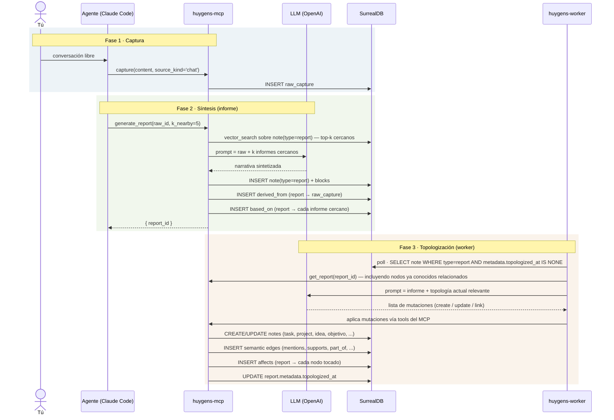

# Huygens — Modelo (v2)

> Documento canónico. Reemplaza toda la documentación conceptual anterior, que ha sido eliminada en una pasada de limpieza. Si algún otro doc contradice este, **este gana** hasta que se reescriba el otro.

---

## En una frase

> Hablas con un agente, eso queda registrado como un raw, lo sintetizas en un **informe**, y un worker pequeño aplica lo que dice ese informe al grafo (crea o modifica tasks, projects, objetivos, ideas, references).

El informe es el corazón del sistema. Todo lo que toca tu grafo pasa por un informe primero. El worker no decide qué eres, decide qué cambia en el grafo dado lo que tú y el agente ya habéis decidido en forma de informe.

---

## El flujo, paso a paso



Hay tres fases claramente diferenciadas. Las dos primeras son **deliberadas** (las inicias tú o tu agente). La tercera es **automática** (el worker la dispara en cuanto detecta un informe nuevo no topologizado).

---

## Actores y responsabilidades

| Actor | Responsabilidad única | Lo que NO hace |
|---|---|---|
| **Tú** | Conversar. Decidir cuándo generar un informe. Aprobar/desaprobar resultados. | Editar SurrealQL a mano. Mantener consistencia del grafo. |
| **Agente conversacional** (Claude Code) | Volcar lo conversado al raw. Generar informes a petición tuya con contexto de informes cercanos. Servirte de interfaz de consulta al grafo. | Modificar el grafo directamente sin pasar por un informe. Decidir solo qué entra al grafo. |
| **huygens-mcp** | Exponer tools y resources. Persistir raws/notas/informes/edges. Hacer la búsqueda vectorial. Llamar al LLM para `generate_report`. | Tomar decisiones de dominio. Es plomería. |
| **LLM** (OpenAI) | Sintetizar narrativa cuando el MCP llama `generate_report`. Producir la lista de mutaciones cuando el worker se lo pide. | Persistir nada. Decidir cuándo se le invoca — siempre lo dispara MCP o worker. |
| **huygens-worker** | Leer informes no topologizados, traducir su contenido semántico a mutaciones del grafo, aplicarlas. **Es un topologizador, nada más.** | Clarificar raws directamente. Generar informes. Decidir cadencia. Crear notas que no vengan de un informe. |
| **SurrealDB** | Persistencia, vector index, audit. | Lógica de dominio. |

El cambio importante respecto a versiones anteriores del sistema: **el worker ya no es el cerebro**. Antes el worker clarificaba raws en notas tomando decisiones de tipo, estado y links. Ahora el cerebro vive en el informe (que TÚ generaste deliberadamente con el agente) y el worker solo lo aplica al grafo. Eso reduce drásticamente la incertidumbre de qué hace el worker — y aumenta tu control.

---

## Entidades del schema

Tres tablas reales más una taxonomía:

### `raw_capture` — evidencia inmutable

```
raw_capture {
  id,
  content        : string         -- el dump literal de la conversación
  source_kind    : string         -- 'chat' | 'voice' | 'manual' | 'import' | 'agent-self'
  source_ref?    : string         -- url, session id, path, etc.
  created_at     : datetime
}
```

Inmutable. Es la única huella de "qué se dijo literalmente". Nunca se edita; las re-interpretaciones crean nuevos informes que apuntan al mismo raw vía `derived_from`.

### `note` — entidad universal tipada

Todo en el grafo de interpretación es un `note`. Lo único que diferencia un task de un informe es el `type`.

```
note {
  id,
  type           : record<note_type>   -- referencia a la taxonomía
  title          : string
  state          : string              -- CLARIFIED (único usado esta fase)
  block_order    : array<record<block>>
  metadata       : option<object>      -- bag flexible por tipo
  created_at     : datetime
  updated_at     : datetime
}
```

Para un informe, `metadata` incluye `topologized_at` (cuando el worker lo procesó) y opcionalmente `period_start` / `period_end` si cubre un periodo.

### `block` — unidad vectorizable

```
block {
  id,
  note            : record<note>     -- el note al que pertenece
  content         : string            -- markdown
  embedding       : option<vector<f32, 1024>>  -- BGE-M3
  embedding_model : option<string>
  dimensions      : option<int>
}
```

La búsqueda vectorial se hace SIEMPRE a nivel de block. Un informe largo tiene muchos blocks; cada uno es buscable por separado.

### `note_type` — taxonomía (10 tipos)

| slug | concepto |
|---|---|
| `task` | acción concreta |
| `project` | outcome multi-paso |
| `area` | área de responsabilidad continua |
| `routine` | rutina recurrente (clasificación, sin engine RRULE en esta fase) |
| `note` | observación libre |
| `report` | **informe sintetizado — el corazón del sistema** |
| `person` | persona referenciada |
| `reference` | material externo (URL, libro, paper) |
| `objetivo` | meta estratégica |
| `idea` | concepto generativo sin compromiso |

Los 10 tipos coexisten desde día uno. Solo `report` es estructuralmente especial — es el único que dispara la fase 3 (topologización).

---

## Edges

Tres familias funcionales.

### Procedencia (cross-plane)

```
note  --derived_from-->  raw_capture
```

Cualquier `note` (especialmente informes) puede apuntar al raw que la originó. Lleva campo `transformation`: `verbatim` | `extracted` | `summarized` | `inferred`.

### Cadenas de informes

```
note(type=report)  --based_on-->  note(type=report)
```

Cuando generas un informe nuevo usando informes anteriores como contexto, se crea un `based_on` desde el nuevo a cada uno de los anteriores que se usaron. Lleva metadata opcional: `relevance_score` (similitud), `reason` (razón breve).

Esto crea **un grafo temporal-narrativo** dentro de los informes: cada nuevo informe está apoyado sobre los anteriores que lo precedieron y los nuevos pueden ser leídos como continuaciones explícitas. Auditable: para cualquier informe puedes ver "estos otros lo influenciaron".

### Mutaciones de topología

```
note(type=report)  --affects-->  note(cualquier tipo)
```

Cuando el worker topologiza un informe, por cada nodo creado o modificado emite un `affects` desde el informe. Lleva:
- `action`: `created` | `updated` | `state_changed` | `linked` | `archived`
- `summary`: una frase explicando el cambio
- `block_ref?`: id del block del informe que motivó este cambio

Estas son **la huella de qué hizo el worker, motivada por qué fragmento concreto del informe**. Si más tarde quieres preguntar "¿por qué este task existe?", sigues `affects` inverso, llegas al informe, y dentro del informe te puede señalar el block exacto.

### Edges semánticos (entre notes, no específicos de informe)

Estos los crea el worker cuando topologiza, según lo que el informe dice:

```
note  --mentions-->     note          referencias, relaciona con
note  --supports-->     note          refuerza, evidencia para
note  --refutes-->      note          contradice
note  --part_of-->      note          jerarquía (Project → Task, Area → Project)
note  --blocked_by-->   note          dependencia
note  --about-->        note          un informe que cubre nodos (también lo usa el agente al generar)
note  --authored_by-->  note(person)  autoría
```

El worker es quien decide qué edges semánticos crear entre nodos al topologizar un informe — proponiendo cómo se relacionan las cosas que el informe menciona. Esto es decisión sobre estructura relacional, no sobre tipos: el informe ya fija qué se está creando y de qué tipo; el worker solo elabora las conexiones. Es la parte de su trabajo donde más LLM interviene.

---

## El ciclo de vida, contado linealmente

### 1. Conversación → raw

Tú abres Claude Code, charlas con el agente sobre lo que sea — un problema de Govoy, una idea para Huygens, una nota de algo que pasó hoy. En algún momento el agente dice "lo dejo registrado" y llama `capture(content, source_kind='chat')` con el dump literal de los últimos turnos relevantes. Se crea un `raw_capture` inmutable. No pasa nada más.

Puedes capturar varias veces durante una misma sesión. Cada captura es un raw independiente. El agente, no tú, decide cuándo y qué cortar.

### 2. Raw → informe (síntesis con contexto)

Cuando consideras que hay material suficiente (o cuando explícitamente lo pides), el agente llama `generate_report(raw_id, k_nearby=5)`:

1. El MCP carga el raw.
2. El MCP hace `vector_search` sobre la colección de informes existentes, devuelve los top-5 más cercanos.
3. El MCP arma un prompt: "aquí está la conversación reciente; aquí están los informes previos relacionados; sintetiza un nuevo informe que continúe la narrativa".
4. El LLM produce el informe.
5. Se crea `note(type=report)` con sus blocks.
6. Se crea `derived_from` (informe → raw).
7. Se crea un `based_on` por cada informe anterior usado.

El informe queda en el grafo, **pero todavía no ha impactado nada más**. Su existencia es interesante por sí misma (puedes leerlo, mejorarlo, descartarlo), pero no ha modificado ningún task ni project todavía.

Puedes regenerarlo si no te gusta. Puedes editar sus blocks a mano vía MCP tools. Solo cuando lo das por bueno, dejas que la fase 3 se dispare.

### 3. Informe → topología (worker)

El worker tiene un poll loop de ~5s sobre informes con `metadata.topologized_at IS NONE`. Cuando ve uno nuevo:

1. Carga el informe completo (todos sus blocks).
2. Carga la **topología relevante** — los nodos que probablemente sean afectados. Esto lo hace vía vector search del contenido del informe contra todas las notes, recuperando, digamos, los 20 nodos más cercanos. Esto le da al worker contexto: "estos son los projects, tasks, ideas, objetivos que ya existen y son potencialmente relevantes".
3. Llama al LLM con: "este es el informe; este es el subgrafo relevante; produce una lista de mutaciones".
4. El LLM produce algo como:
   ```
   [
     { action: 'update', target: 'note:govoy-project', changes: { state: 'ACTIVE' }, reason_block: blk_3 },
     { action: 'create', new_node: { type: 'task', title: 'wire SHAP integration', blocks: [...] }, edges: [ { kind: 'part_of', target: 'note:govoy-project' } ], reason_block: blk_5 },
     { action: 'create', new_node: { type: 'idea', title: 'Tuesday afternoons reservados', blocks: [...] }, edges: [ { kind: 'mentions', target: 'note:govoy-project' } ], reason_block: blk_7 }
   ]
   ```
5. El worker aplica cada mutación vía MCP tools (mismas que ya existen — commit_clarify, etc).
6. Por cada nodo tocado, crea un `affects` desde el informe a ese nodo.
7. Marca `report.metadata.topologized_at = now`.

Idempotencia: si el worker se reinicia a media topologización, el `affects` ya emitido le sirve para saber qué ya está hecho. La operación es resumible.

Resultado: tu grafo se ha actualizado. Tasks nuevas existen, projects han movido de estado, ideas se han linkeado a sus contextos. Y existe la huella `affects` que te dice "este informe causó estos cambios".

---

## Por qué este diseño

Tres propiedades importantes que emergen:

### Trazabilidad total

Para cualquier nodo del grafo, puedes preguntar "¿de dónde vienes?":
- Sigues `derived_from` o `affects` inverso → llegas al informe que te creó.
- En el informe, ves la narrativa de tu razón de ser.
- Sigues `based_on` desde el informe → ves los informes anteriores que lo influenciaron.
- Sigues `derived_from` desde el informe → ves la conversación literal que lo motivó.

El árbol completo de "por qué este task existe en mi sistema" es navegable hasta la frase original que dije en una conversación.

### Determinismo en la mutación

El grafo NO se modifica sin un informe que lo motive. Esto significa:
- No hay clarificaciones silenciosas del worker leyendo raws sueltos.
- Cada cambio del grafo tiene una "razón documental" verificable.
- Si quieres deshacer algo, identificas el informe responsable y reversas sus `affects` (o lo marcas como "ignorado por el topologizador").

### Compounding semántico

Los `based_on` entre informes crean una **narrativa temporal**. Cada vez que generas un informe nuevo, no parte de cero — parte de los informes anteriores. El sistema te ayuda a no repetirte y a continuar líneas de pensamiento. Después de 6 meses tendrás cadenas largas de informes que cuentan una historia coherente sobre cada proyecto/área/objetivo.

---

## Lo que el worker NO hace

Esta sección es importante porque la implementación actual del worker hace cosas que en este modelo nuevo NO debería hacer:

- ❌ **NO clarifica raws directamente.** En el modelo viejo, raw aparecía en el inbox → worker lo convertía en notes. En este modelo, raws solo se convierten en informes vía `generate_report`, que dispara el agente conversacional. El worker no toca raws.
- ❌ **NO genera informes.** `generate_report` lo dispara el agente, no el worker. El worker es lector de informes, no generador.
- ❌ **NO decide qué tipo es algo.** El LLM al que invoca el worker decide tipos, pero está restringido a aplicar lo que ya dice el informe. No tiene libertad de re-interpretar.
- ❌ **NO mantiene cadencias.** No hay RRULE engine. Las rutinas son clasificación, no operación.

El worker hace una sola cosa: **leer informes nuevos, traducirlos a mutaciones, aplicarlas con audit**. Eso es todo.

---

## Lo que está fuera del scope de esta fase

Algunas cosas tienen reserva de schema pero **no se implementan / no se enforced** ahora:

| pieza | estado |
|---|---|
| Estados ACTIVE / WAITING / SOMEDAY / DONE / ARCHIVED | Acepta el schema; solo `CLARIFIED` se usa por defecto. Las transiciones via `affects(action='state_changed')` están permitidas pero no obligatorias. |
| `mit_for` field | Existe en schema, no se popula. Planning es fase posterior. |
| Routines con RRULE engine | `routine` es solo clasificación; no hay dual-loop en el worker. |
| Reviews-as-entity, commits_to, emerged_during, touched | Diseñados conceptualmente en discusiones previas, pero NO en este modelo. Si vuelven, será como extensión deliberada de este. |
| Dashboard | No existe. Sin priorizar. |

---

## Glosario rápido

| término | significado |
|---|---|
| **raw** | un `raw_capture`. Lo que se dijo literalmente. Evidencia. |
| **informe** / **report** | un `note(type=report)`. Síntesis narrativa generada deliberadamente. Corazón del sistema. |
| **topologizar** | aplicar lo que un informe dice al grafo de nodos tipados. Lo hace el worker. |
| **topología** | el grafo de notes + edges (excluyendo raws y la capa de informes). |
| **nodo afectado** | una `note` (típicamente task/project/idea/objetivo/reference) modificada o creada por la topologización de un informe. |
| **informe cercano** | informe previo con alta similitud vectorial al raw o al subgrafo afectado. Se usa como contexto al generar uno nuevo. |
| **fase 1, 2, 3** | captura, síntesis, topologización. |

---

## Estado de implementación

Para que sepas qué hay que tocar:

| pieza | hoy | objetivo del modelo nuevo |
|---|---|---|
| `capture` tool | ✅ existe | igual |
| `raw_capture` tabla | ✅ existe | añadir nada — la inmutabilidad ya está |
| `generate_report` tool | ✅ existe (genera narrativa) | **adaptar**: añadir param `k_nearby`, hacer vector_search sobre informes existentes, crear edges `based_on` |
| `note(type=report)` | ✅ existe | añadir `metadata.topologized_at` |
| `derived_from` edge | ✅ existe (note → raw_capture) | igual |
| `based_on` edge | ❌ falta | **añadir**: relation note(report) → note(report) |
| `affects` edge | ❌ falta | **añadir**: relation note(report) → note(any), con `action` y `summary` |
| Worker — clarify de raws | ✅ existe pero **debe retirarse** | **retirar** |
| Worker — topologizador de informes | ❌ falta | **añadir**: poll de informes con `topologized_at IS NONE`, prompt nuevo, aplicación de mutaciones |
| Prompts MCP | `clarify-system` registrado | **reemplazar** por `topologize-system` |
| Lore MCP | `clarify-spec`, `data-model` | **reescribir** ambos a partir de este doc |

---

## Próximos pasos (sin acción todavía)

1. Migrar `generate_report` para usar contexto de informes cercanos (vector search + based_on edges).
2. Añadir tablas `based_on` y `affects` al schema.
3. Reescribir el worker en modo topologizador (drop clarify path, add topologize loop).
4. Sustituir `clarify-system` prompt por `topologize-system`.
5. Reescribir `clarify-spec.md` LORE a `topologize-spec.md`.
6. Actualizar `CLAUDE.md` para apuntar a este doc como canónico.

Ninguno está hecho. Este doc es solo el modelo; la implementación es la siguiente conversación.
