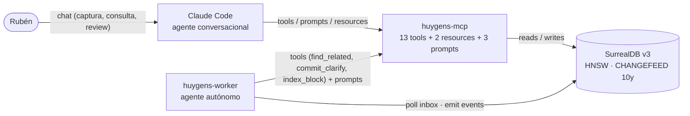
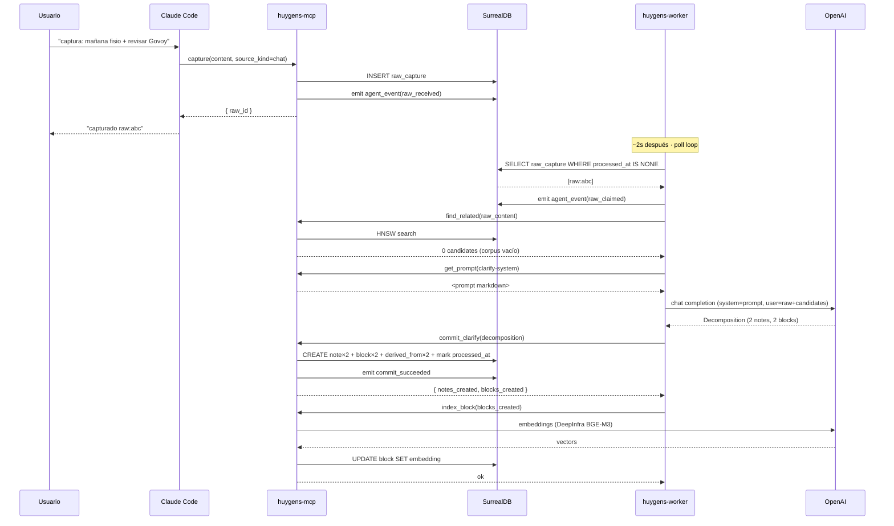
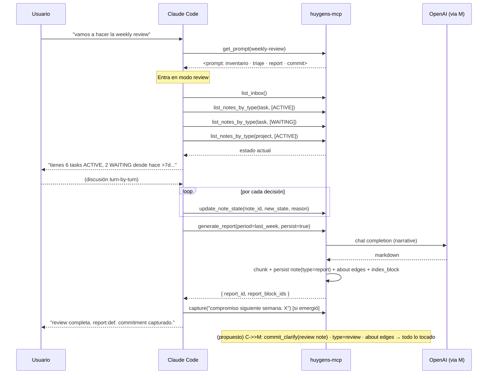
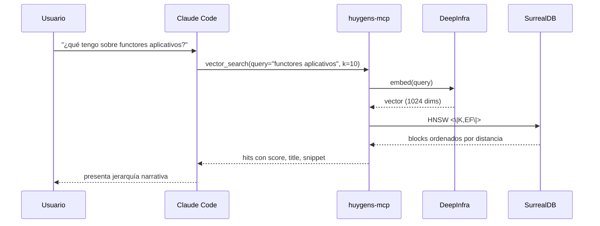
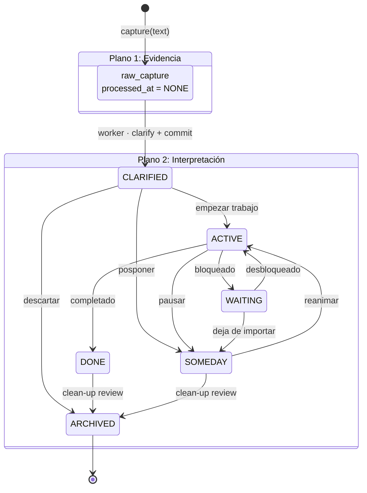
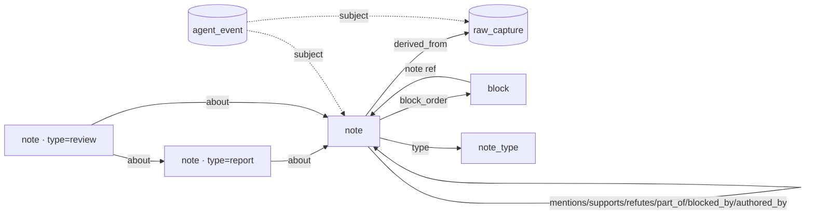
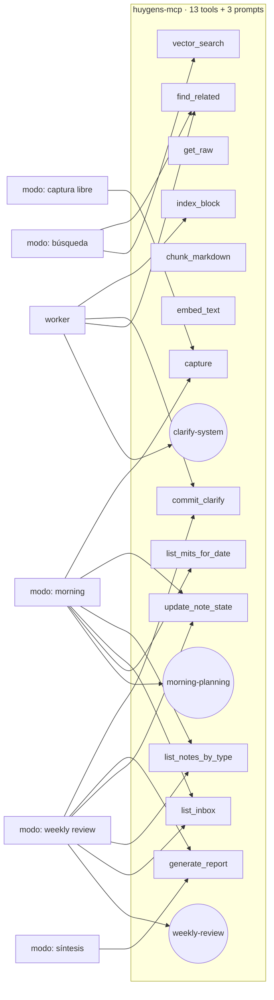

# Huygens — Casos de uso y flujos

Mapa exhaustivo de quién hace qué en Huygens, con visualizaciones de los flujos principales. Este doc es la fotografía actual del sistema — cuando cambien las cosas, se actualiza aquí.

---

## 1. Actores



| actor | rol | responsabilidad |
|---|---|---|
| **Usuario** | originador | captura raws, decide acciones, gobierna el sistema |
| **Agente conversacional** (Claude Code) | facilitador | traduce intención del usuario a tool calls; carga prompts del MCP para entrar en modos |
| **Worker autónomo** (Agno + GPT-4o-mini) | procesador | clarifica el inbox autónomamente, sin intervención |
| **MCP server** | superficie | expone tools, lore, prompts canónicos |
| **SurrealDB** | sustrato | persiste todo · audita todo |

---

## 2. Casos de uso por actor

### 2.1 Usuario (vía agente conversacional)

#### Captura
- **Capturar un pensamiento crudo** — "captura: mañana cita con el dentista a las 10 y revisar el contrato del cliente antes del viernes"
- **Capturar una idea generativa** — "idea: aplicar functores aplicativos al sistema de queries"
- **Capturar transcripción de voz** — input pegado desde transcriptor
- **Capturar referencia externa** — URL/libro/paper

#### Consulta sobre estado actual
- **¿Qué tengo pendiente?** → `list_inbox` (raws sin procesar)
- **¿Qué hay para hoy?** → `list_mits_for_date(today)`
- **¿Qué tasks activos tengo?** → `list_notes_by_type(task, [ACTIVE, CLARIFIED])`
- **¿Qué proyectos llevo en marcha?** → `list_notes_by_type(project, [ACTIVE])`
- **¿Qué ideas tengo CLARIFIED sin promover?** → `list_notes_by_type(idea, [CLARIFIED])`

#### Búsqueda / recall semántico
- **¿Qué dije sobre X?** → `vector_search(query=X)`
- **Dame contexto relacionado con esta idea** → `find_related(query)`
- **Detalle de un raw** — "muéstrame raw_capture:abc" → `get_raw(id)`

#### Acción sobre notas existentes
- **Mover de estado** ("ya está hecho", "esto se bloqueó") → `update_note_state`
- **Iniciar trabajo en algo** (CLARIFIED → ACTIVE) → `update_note_state`
- **Archivar lote viejo** — bucle de `update_note_state` con state=ARCHIVED

#### Síntesis / report
- **Genera un report de esta semana** → `generate_report(period, persist=true)`
- **Genera un report sobre un objetivo concreto** → `generate_report(note_ids=[...])`
- **Solo dame el markdown sin persistir** → `generate_report(persist=false)`

#### Modos estructurados (cargan un prompt del MCP)
- **Morning planning** — agente carga `prompts/morning-planning`
- **Weekly review** — agente carga `prompts/weekly-review`
- **(futuro)** reflection, inbox-zero, planning-session

### 2.2 Worker autónomo

Una sola misión. No decide cuándo trabajar — siempre que haya cola.

- **Polling del inbox** cada 2s — fetch `raw_capture WHERE processed_at IS NONE`
- **Claim** — emite `raw_claimed` event, marca en `seen_processed` (in-memory)
- **Pre-fetch RAG** — llama `find_related(raw_content)` para evitar duplicación
- **Clarify (cognición)** — Agno + GPT-4o-mini produce `Decomposition` Pydantic
- **Commit** — llama `commit_clarify_via_mcp` (atómico, idempotente)
- **Index** — llama `index_block_via_mcp` para los blocks creados
- **Resilencia ante RAW_ALREADY_PROCESSED** — silent success, marca seen

### 2.3 Modos del agente conversacional — qué hace cada uno

Cada modo es un prompt del MCP. Cuando el usuario solicita el modo (o el agente lo infiere), se carga ese prompt como context.

```mermaid
flowchart TB
    user([Usuario])
    user -->|"captura: X"| capture["Captura libre<br/>(sin modo)"]
    user -->|"buenos días, qué tengo hoy"| morning["Morning planning"]
    user -->|"vamos a revisar la semana"| weekly["Weekly review"]
    user -->|"¿qué dije sobre X?"| search["Búsqueda / recall"]
    user -->|"genera un report"| report["Síntesis"]

    capture -->|"capture(text)"| inbox[(inbox)]
    morning -->|"list_mits + list_inbox<br/>+ discutir + update_state"| kg[(grafo)]
    weekly -->|"inventory + triage<br/>+ generate_report + review note"| graph
    search -->|"vector_search + find_related"| graph
    report -->|"generate_report"| graph
```

| modo | prompt | qué hace |
|---|---|---|
| Captura libre | (ninguno) | un solo turno: capturar y devolver |
| Morning planning | `morning-planning` | surface MITs + inbox · discutir realismo · decidir EL UNO · transiciones |
| Weekly review | `weekly-review` | inventario · triaje WAITING/SOMEDAY · generar report · próximo commit |
| Búsqueda | (ninguno) | recall semántico ad-hoc |
| Síntesis | (ninguno) | generar narrativa sobre un periodo o un grupo |
| **Reflection** (futuro) | `reflection` | resurfar nota vieja, cuestionar coherencia |
| **Inbox zero** (futuro) | `inbox-zero` | procesar el inbox manualmente (cuando worker falló) |

---

## 3. Flujos principales (sequence diagrams)

### 3.1 Captura → procesamiento autónomo



### 3.2 Weekly review (modo conversacional)



### 3.3 Búsqueda semántica simple



---

## 4. Ciclo de vida de un pensamiento



Cualquier nota puede saltar a cualquier estado en cualquier momento — la máquina de estados es **canónica, no enforcada** por el schema. Las transiciones "no canónicas" (DONE → ACTIVE = reabrir) están permitidas técnicamente.

---

## 5. Topología del grafo



**Edges narrativos (note↔note)**: `mentions`, `supports`, `refutes`, `part_of`, `blocked_by`, `about`, `authored_by`.
**Edge de procedencia (cross-plane)**: `derived_from`.

---

## 6. Mapeo modo ↔ tools del MCP



---

## 7. Lo que NO está cubierto (y necesita decisión)

- **Modo reflection**: resurfar nota vieja, cuestionar si sigue siendo cierta. Sin prompt aún.
- **Modo inbox-zero**: procesar inbox manualmente cuando el worker falló o quieres control. Sin prompt aún.
- **`note · type=review` como entidad propia**: hoy un weekly-review produce un `report`, pero la SESIÓN no se representa en grafo. Propuesta en discusión.
- **`refine_report(report_id, instruction)`**: AI regenera un report manteniendo id + edges. No existe.
- **Backup / export del corpus**: el SurrealDB volume es el único sitio.
- **Logging implícito** (feedback infrastructure): `note_accessed`, `search_result_consumed`, `clarify_corrected` no se emiten. Sin esto, los planes de "Huygens aprende mi criterio" tienen cold-start eterno.

Ver `docs/architecture/ideas/` para las ideas parqueadas asociadas.

---

## 8. Resumen ejecutivo en una frase

> El **usuario** captura intención cruda → el **worker** la interpreta autónomamente al grafo tipado → el **agente conversacional** ayuda al usuario a navegar, decidir y sintetizar usando los mismos tools que el worker.

Los tres actores comparten el mismo MCP. El MCP lleva la verdad de qué se puede hacer (tools), cómo está estructurado el grafo (resources de LORE), y cómo "ser" un agente Huygens en distintos modos (prompts).
