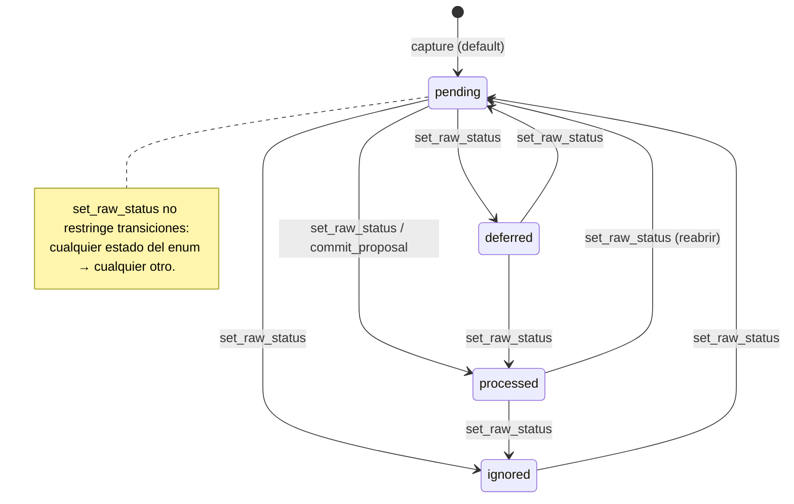

# Huygens — Functional Specification: `capture-and-inbox`

> App: `huygens` · Initiative: `capture-and-inbox` · Plane 1 (Evidencia)
>
> Documento de comportamiento funcional derivado del código implementado
> (ingeniería inversa). Describe el comportamiento **real**, no el ideal.
> Evidencia primaria: `apps/mcp/src/tools/capture.ts`,
> `apps/mcp/src/tools/list-inbox.ts`, `apps/mcp/src/tools/set-raw-status.ts`,
> sus tests en `apps/mcp/test/`, el schema `apps/mcp/surreal/schema.surql`
> (tabla `raw_capture`), y la doctrina operativa
> (`apps/mcp/src/lore/operating-doctrine.md`).

## 1. Summary

Esta iniciativa cubre el **plano de evidencia** de Huygens: la captura del
input literal del usuario durante el día y el **inbox** que lo acumula sin
interpretarlo. La pieza física es el registro `raw_capture`: el acta inmutable
de *lo que el usuario realmente dijo*. El principio rector es la **captura sin
ceremonia**: si el usuario suelta algo, se captura sin preguntar; la captura es
evidencia y **no compromete el grafo** (no crea ni cambia notas, blocks ni
edges).

La iniciativa expone tres operaciones funcionales: persistir un raw (`capture`),
listar el inbox por estado (`list_inbox`, por defecto los `pending`) y cambiar el
estado de uno o varios raws sin crear topología (`set_raw_status`). El ciclo de
vida de un raw es `pending → processed | ignored | deferred`, donde el campo
`status` es la **fuente de verdad** del inbox y `processed_at` solo se conserva
por compatibilidad legacy.

Queda **fuera de esta iniciativa**: convertir raws en interpretación (notas,
blocks, edges) → `processing-proposals-and-commit`; la mecánica del edge de
procedencia `derived_from` y el grafo → `graph-model-notes-and-topology`; cómo
el agente conversacional *decide* capturar o disponer → `conversational-agent-worker`
y `rituals-and-coaching`. Aquí solo se documenta el acto físico de capturar,
listar y re-estatus.

## 2. Actors & Roles

| Actor | Rol respecto a esta iniciativa |
|---|---|
| **Usuario (Rubén)** | Suelta fragmentos durante el día. No interactúa con las tools directamente; habla con un agente. Decide (mediante orden al agente) qué se ignora, difiere o da por procesado. |
| **Agente conversacional (cliente MCP completo)** | P. ej. Claude Code, Codex, Hermes. Es quien **llama** `capture`, `list_inbox` y `set_raw_status` en nombre del usuario. Captura sin pedir permiso; dispone (ignorar/diferir) solo cuando el usuario lo ordena. |
| **Worker del dashboard (agente Agno + OpenAI)** | Segundo cliente conversacional, en la UI. Tiene `capture`, `list_inbox` y `set_raw_status` en su toolset (solo `commit_proposal` está excluido), de modo que puede capturar y disponer raws igual que un cliente completo. |
| **MCP Huygens** | Frontera de persistencia y validación. Ejecuta las tres tools, valida los inputs (Zod), persiste en SurrealDB y emite eventos de auditoría. No toma decisiones de dominio. |
| **SurrealDB** | Almacena la tabla `raw_capture` (schemafull, con CHANGEFEED de 10 años) y aplica las aserciones de schema (enums de `status` y `source_kind`, default `pending`). |

No hay roles/permisos diferenciados *dentro* de esta iniciativa: cualquier
cliente con acceso al MCP puede capturar, listar y re-estatus. La asimetría de
permisos del producto (quién puede commitear) pertenece al ciclo de proposal,
fuera de scope.

## 3. Goals & User Jobs

- **Capturar sin fricción.** El usuario quiere soltar una idea, recordatorio o
  fragmento y que quede guardado literalmente, sin que nadie le interrogue ni le
  obligue a clasificarlo en el momento. *(Job principal.)*
- **No forzar interpretación inmediata.** El inbox existe precisamente para que
  un fragmento pueda quedarse pendiente y procesarse más tarde, en una sesión
  deliberada. La captura es barata; la interpretación es otra fase.
- **Preservar la evidencia tal cual.** El usuario confía en que lo capturado es
  *exactamente* lo que dijo, sin que el sistema lo parta, resuma o adivine — eso
  es lo que más tarde hace la memoria auditable y citable.
- **Vaciar/triagear el inbox.** El usuario (vía agente) quiere poder marcar
  ruido como `ignored`, aplazar lo no accionable como `deferred`, o dar por
  cerrado lo ya tratado como `processed`, **sin** que ese gesto cree topología.
- **Ver qué hay pendiente.** Tanto el agente (para procesar) como el usuario (en
  el dashboard) quieren consultar el contenido del inbox por estado.

## 4. Entry Points

Todas las entradas funcionales son **tools MCP** (no hay UI de escritura ni API
REST propia para esta iniciativa). La superficie canónica y al día vive en la
*Tools surface* de `apps/mcp/src/lore/data-model.md`.

| Entry point | Tipo | Qué hace |
|---|---|---|
| `capture` | Tool MCP (escritura, Plane 1) | Persiste un `raw_capture` nuevo con `status='pending'`. Devuelve `Captured: <raw_id>` y, programáticamente, `{ raw_id }`. |
| `list_inbox` | Tool MCP (lectura) | Lista raws por estado (por defecto `pending`), orden `created_at` ASC, con filtro opcional por `source_kind` y `limit`. Devuelve un resumen en texto + JSON crudo. |
| `set_raw_status` | Tool MCP (escritura, Plane 1) | Cambia el `status` de 1..100 raws a un estado del enum. No crea notas/blocks/edges. Devuelve `[{ id, status, processed_at }]`. |
| **Inbox del dashboard** (`/?view=inbox`) | Pantalla web (solo lectura) | Lista los `raw_capture` pendientes leídos directamente de SurrealDB (vía `listInbox()`), con un badge de recuento. Estado vacío explícito. **No** dispone raws (no llama `set_raw_status`); la disposición ocurre conversando con el agente. |

Salidas de evidencia hacia otras iniciativas (referencia, no se documentan
aquí): un raw se conecta a su interpretación mediante el edge `derived_from`
(propiedad de `graph-model-notes-and-topology`); `commit_proposal` marca raws
como `processed` al consumirlos (propiedad de `processing-proposals-and-commit`).

## 5. Workflows

### Workflow 1 — Capturar un fragmento (captura sin ceremonia)

- **Trigger**: el usuario suelta algo al agente que es *solo soltar algo* (no es
  consulta, ni corrección/orden, ni petición de procesar). Por doctrina, el
  agente captura **sin preguntar**.
- **Pasos**:
  1. El agente llama `capture` con `content` (el texto literal del usuario, sin
     segmentar ni interpretar), `source_kind` y opcionalmente `source_ref`.
  2. El MCP valida el input (ver §6): `content` no vacío; `source_kind` dentro
     del enum.
  3. El MCP ejecuta `CREATE raw_capture CONTENT $data RETURN AFTER`. El schema
     asigna `status='pending'` y `created_at = time::now()` (READONLY).
  4. El MCP emite un `agent_event` de tipo `raw_received` (actor
     `conversational`, `session_id` nuevo, `subject` = id del raw, payload con
     `source_kind` y `content_length`).
  5. Se registra la llamada en `mcp_tool_call` (append-only).
- **Fin**: el raw queda en el inbox con `status='pending'`. La tool devuelve
  `Captured: <raw_id>`. El grafo **no** se ha tocado.
- **Camino alterno — captura en bloque**: si el usuario suelta varias cosas,
  el agente puede llamar `capture` varias veces; **cada llamada crea un raw
  independiente**. La tool no parte ni agrupa un único texto en varios raws
  (eso sería interpretación). La granularidad la fija el llamante con N
  llamadas, no el sistema dividiendo una.
- **Camino de error — `content` vacío**: el schema Zod (`z.string().min(1)`)
  rechaza un `content` vacío antes de tocar la BD; no se crea raw.

### Workflow 2 — Consultar el inbox

- **Trigger**: el agente va a procesar el inbox, o el usuario abre la pantalla
  Inbox del dashboard, o cualquier consulta de "¿qué tengo pendiente sin
  procesar?".
- **Pasos**:
  1. Se llama `list_inbox` con `status` (default `pending`), `limit` (default
     20, máx 100) y `source_kind` opcional.
  2. El MCP ejecuta un `SELECT ... FROM raw_capture WHERE status = $status
     [AND source_kind = $source_kind] ORDER BY created_at ASC LIMIT $limit`.
  3. Devuelve un resumen legible (una línea por raw: id, status, source_kind,
     created_at y los primeros 80 caracteres del contenido, truncados con `...`)
     seguido del JSON crudo de las filas.
- **Fin**: el llamante tiene la lista del inbox para ese estado.
- **Camino alterno — inbox vacío**: si no hay raws en ese estado, el resumen es
  `No raws with status=<status>.` y la lista JSON es `[]`. El dashboard muestra
  el placeholder *"Inbox vacío. Las capturas pendientes (raw_captures sin
  procesar) aparecerán aquí."*
- **Camino alterno — otros estados**: pasando `status='deferred'` o
  `'ignored'` o `'processed'` se listan explícitamente esos raws. Listar un
  estado **nunca** filtra/mezcla filas de otro estado.

### Workflow 3 — Disponer raws (ignorar / diferir / dar por procesado) sin crear topología

- **Trigger**: durante una sesión de proceso (u orden explícita del usuario), un
  raw no debe convertirse en topología: es ruido (`ignored`), no accionable
  todavía (`deferred`), o ya tratado por otra vía (`processed`).
- **Pasos**:
  1. El agente llama `set_raw_status` con `raw_ids` (1..100 ids con formato
     `raw_capture:...`) y el `status` destino.
  2. El MCP **verifica primero que todos los ids existen** (`SELECT id FROM
     raw_capture WHERE id IN $ids`). Si falta alguno, aborta (ver error abajo).
  3. Aplica `UPDATE raw_capture SET status = $status [, processed_at = ...]
     WHERE id IN $ids RETURN AFTER`. El ajuste de `processed_at` depende del
     estado (ver §6).
  4. Emite un `agent_event` de tipo `raw_status_changed` (payload con `raw_ids`
     y `status`). Registra la llamada en `mcp_tool_call`.
- **Fin**: los raws quedan en el nuevo estado. La tool devuelve
  `[{ id, status, processed_at }]`. **No** se han creado notas, blocks ni edges.
- **Camino de error — id inexistente (lote atómico)**: si *cualquiera* de los
  `raw_ids` no existe, la tool lanza `RawNotFoundError` (mensaje "raw_capture not
  found: ...") **antes** de aplicar ningún cambio; ningún raw del lote se toca
  (verificado en test: el raw real permanece `pending` con `processed_at` null).
- **Camino de error — input inválido**: un `status` fuera del enum, un id
  malformado (p. ej. `note:abc`), un array vacío o con más de 100 ids → rechazo
  de schema (Zod) antes de tocar la BD.

### Workflow 4 — Reabrir un raw procesado

- **Trigger**: se marcó un raw como `processed` (manual o por commit) y hay que
  devolverlo al inbox.
- **Pasos**: `set_raw_status` con `status='pending'`. El `UPDATE` además pone
  `processed_at = NONE`.
- **Fin**: el raw vuelve a aparecer en `list_inbox` por defecto y su
  `processed_at` queda limpio (null) — verificado en test
  (*"moving back to pending clears a previously-set processed_at"*).

## 6. Functional Rules & Constraints

### Validaciones de entrada (`capture`)

- `content`: string requerido, **no vacío** (`z.string().min(1)`). Es el texto
  literal; el contrato prohíbe explícitamente interpretarlo, segmentarlo o
  adivinar ("no interpretation, no segmentation").
- `source_kind`: requerido, uno de `chat | voice | manual | import |
  agent-self`. Enforced en dos capas: Zod en la tool y `ASSERT $value INSIDE
  [...]` en el schema de la tabla.
- `source_ref`: opcional. Si se omite, el campo queda **NONE** (no `null`) —
  verificado en test (`source_ref absent stays NONE, not null`).

### Validaciones de entrada (`list_inbox`)

- `limit`: entero positivo, **máx 100**, **default 20**.
- `status`: del enum de raw, **default `pending`**.
- `source_kind`: opcional; si se pasa, restringe el resultado a ese origen.
- Orden de salida: siempre `created_at` ASC (lo más antiguo primero — orden de
  cola/inbox).
- El resumen trunca el contenido a 80 caracteres (con `...` si excede); el JSON
  crudo lleva el contenido completo.

### Validaciones de entrada (`set_raw_status`)

- `raw_ids`: array de **1 a 100** ids, cada uno con patrón
  `^raw_capture:[A-Za-z0-9_-]+$`. Vacío, >100, o un id de otra tabla → rechazo.
- `status`: requerido, del enum de raw.
- **Existencia atómica**: todos los ids deben existir o la operación entera se
  rechaza sin efectos parciales.

### Ciclo de vida del estado (state machine)

`status ∈ { pending, processed, ignored, deferred }`. `status` es la **fuente
de verdad** del inbox.



- Cualquier transición entre estados del enum está permitida; `set_raw_status`
  no impone un orden (lo verifica la suite, p. ej. `deferred → processed`,
  `processed → pending`).
- Regla de `processed_at` al cambiar de estado:
  - `→ processed`: estampa `processed_at = time::now()`.
  - `→ pending`: limpia `processed_at = NONE`.
  - `→ ignored` o `→ deferred`: **no toca** `processed_at` (queda como estaba).
- `processed_at` es **compatibilidad legacy**: no es la señal primaria del inbox
  y no debe leerse como fuente de verdad. La fuente es `status`.

### Defaults

- `status` por defecto: `pending` (default tanto en el schema de la tabla como
  el comportamiento esperado de `capture`).
- `created_at`: `time::now()`, **READONLY** (inmutable tras la creación).
- `list_inbox`: `status=pending`, `limit=20`.

### Invariante de "captura ≠ interpretación" (regla de producto)

- `capture` **nunca** parte, resume ni adivina; persiste el texto tal cual.
- `set_raw_status` **nunca** crea notas, blocks ni edges — verificado en test
  (cuenta de `note` y `block` = 0 tras mover un raw a `ignored`). Es un cambio de
  estado puro en Plane 1.
- Estos dos efectos (capturar y re-estatus) **mutan Plane 1 directamente, por
  diseño**: capturar es barato y no compromete el grafo. Es la excepción
  consciente a la regla "nada estructural muta fuera de una propuesta" (que
  aplica solo al grafo de interpretación). Documentado en la *nota de perímetro*
  de la doctrina y del data-model.

### Permisos / frontera de escritura

- No hay control de permisos por actor dentro de esta iniciativa: las tres tools
  son utilizables por cualquier cliente MCP, incluido el worker del dashboard.
- Estas escrituras a `raw_capture` **no** pasan por el rol VIEWER de
  `huygens_reader` (ese muro protege el grafo de interpretación, no el plano de
  evidencia). `capture`/`set_raw_status` escriben con la conexión de servicio.

### Estados de error visibles

| Situación | Efecto |
|---|---|
| `content` vacío en `capture` | Rechazo de validación; no se crea raw. |
| `source_kind` fuera del enum | Rechazo (Zod + ASSERT schema). |
| `raw_ids` con un id inexistente | `RawNotFoundError` (code `RAW_NOT_FOUND`); **ningún** raw del lote cambia. Se devuelve como tool error estructurado (`isError: true`, `structuredContent.error.code`) que el worker Python reconstruye como excepción tipada. |
| `status` inválido / id malformado / lote vacío o >100 | Rechazo de schema antes de la BD. |
| Inbox vacío en `list_inbox` | Texto `No raws with status=<status>.` + lista vacía (no es error). |

### Auditoría (transversal, evidencia funcional)

- `capture` emite `agent_event:raw_received`; `set_raw_status` emite
  `agent_event:raw_status_changed`. Ambos append-only.
- Toda invocación de tool se registra en `mcp_tool_call` (tool, ok, duración,
  args, result/error). El sistema "nunca muta en silencio": o hay `agent_event`
  (intención), o el CHANGEFEED (10y) tiene el diff, o ambos. *(El detalle de
  trust/provenance pertenece a `audit-provenance-and-trust`; aquí se constata
  que cada captura y cada cambio de estado dejan rastro.)*

## 7. Data Concepts

- **`raw_capture` (raw / captura)** — el acta literal e inmutable de lo que el
  usuario dijo. Es "el inbox real". Campos perceptibles a nivel de producto:
  - `content`: el texto literal, sin interpretar.
  - `source_kind`: de dónde vino el input — `chat` (mensaje de chat con el
    agente), `voice` (transcripción de voz), `manual` (entrada manual),
    `import` (importación), `agent-self` (input originado por el propio agente).
  - `source_ref`: identificador opcional del origen (id de sesión, ruta de
    fichero, URL…). Ausente ⇒ NONE.
  - `status`: posición en el ciclo del inbox — `pending` (sin procesar, lo que
    forma el inbox vivo), `processed` (ya consumido/tratado), `ignored` (ruido
    descartado), `deferred` (aplazado, no accionable aún). **Fuente de verdad.**
  - `processed_at`: marca de tiempo de "procesado", solo por compatibilidad
    legacy; se rellena al pasar a `processed` y se limpia al volver a `pending`.
  - `created_at`: cuándo se capturó (inmutable).
- **Inbox** — concepto de producto, no una tabla: el conjunto de raws con
  `status='pending'`. Es un **buffer semántico** cuyo propósito es no forzar la
  interpretación inmediata. `list_inbox` sin argumentos lo materializa.
- **Disposición (triage)** — el acto de sacar un raw del inbox sin
  interpretarlo: `ignored` (descartar), `deferred` (aplazar) o `processed`
  (dar por tratado). Es ortogonal a convertirlo en topología.

> Procedencia raw → estructurado: vive en el edge `derived_from` (de `block` a
> `raw_capture`, con campo `transformation`). Se menciona como referencia; su
> mecánica pertenece a `graph-model-notes-and-topology`.

## 8. Graphical Representation

La iniciativa es esencialmente **headless** (tres tools MCP). La única
superficie visual es la pantalla **Inbox** del dashboard (`/?view=inbox`),
**solo lectura**:

```text
┌──────────────────────────────────────────────┐
│ 📥 Inbox            [n]   (badge si n>0)       │
├──────────────────────────────────────────────┤
│ ┌──────────────────────────────────────────┐ │
│ │ meta: source_kind · created_at           │ │  ← un .inbox-item por raw pending
│ │ contenido literal (white-space: pre-wrap)│ │     (borde-izq azul)
│ └──────────────────────────────────────────┘ │
│ ┌──────────────────────────────────────────┐ │
│ │ ...                                      │ │
│ └──────────────────────────────────────────┘ │
│                                                │
│  (vacío) "Inbox vacío. Las capturas           │
│           pendientes (raw_captures sin         │
│           procesar) aparecerán aquí."          │
└──────────────────────────────────────────────┘
```

- Carga los pendientes con `listInbox()` (lectura directa de SurrealDB como
  reader), solo cuando la vista Inbox está abierta; carga "best-effort" (si
  falla, inbox vacío).
- Muestra un **badge de recuento** junto al ítem de navegación cuando hay
  pendientes.
- **No** ofrece acciones de disposición (no hay botones ignorar/diferir): el
  triage se hace conversando con el agente, no desde esta pantalla.
- La captura en sí no tiene UI propia: entra por conversación (chat del
  dashboard o cliente MCP), no por un formulario de esta vista.

## 9. Restrictions & Tradeoffs

- **Captura literal, no inteligente (decisión deliberada).** `capture` no
  segmenta ni resume; si el usuario mete tres asuntos en un mensaje, queda **un
  solo raw** salvo que el agente haga tres llamadas. Trade-off consciente: la
  fidelidad de la evidencia prima sobre la comodidad de tener raws "limpios".
- **`set_raw_status` no transiciona el grafo.** Marcar `processed` a mano **no**
  crea procedencia (`derived_from`) ni interpretación: es un cierre administrativo
  del inbox. La vía que sí materializa interpretación y marca raws `processed`
  con traza es `commit_proposal` (otra iniciativa).
- **Sin transiciones restringidas.** El sistema acepta cualquier cambio entre
  estados del enum (incluido `ignored → pending`); no codifica una máquina de
  estados "legal" más allá del enum. La disciplina de qué estado tiene sentido
  es del agente, no enforced.
- **`processed_at` es ruido legacy.** Se mantiene y se rellena, pero leerlo como
  señal primaria sería un error: solo `status` manda. Coste de arrastrar
  compatibilidad.
- **Tope de lote 100 en `set_raw_status`; tope 100 / default 20 en
  `list_inbox`.** Cambios masivos de >100 raws requieren varias llamadas.
- **Inbox del dashboard solo-lectura.** No se puede disponer ni capturar desde
  esa pantalla; toda mutación de Plane 1 pasa por una conversación con un agente
  que llama las tools.
- **Sin estrategia de backup de los datos** (riesgo conocido a nivel de
  proyecto, `docs/issues/2026-06-09`): perder el volumen pierde el inbox. No es
  específico de esta iniciativa, pero afecta a la evidencia capturada.

## 10. Open Questions & Assumptions

- **Assumption (doctrina, no enforced en estas tools):** "capturar sin
  preguntar" y "disponer solo bajo orden del usuario" son comportamiento del
  *agente* (doctrina operativa), no muros de estas tools. El MCP aceptará un
  `capture` o un `set_raw_status` venga de donde venga; el enforcement de
  *cuándo* capturar/disponer es responsabilidad del cliente (cubierto en
  `conversational-agent-worker` / `rituals-and-coaching`).
- **Assumption:** `agent-self` como `source_kind` (input originado por el propio
  agente) está soportado en el enum, pero el código de esta iniciativa no
  privilegia ese origen frente a los demás; su uso concreto no está evidenciado
  aquí.
- **Not evidenced:** no hay límite de longitud máxima de `content` (el schema es
  `TYPE string` sin tope; Zod solo exige `min(1)`).
- **Not evidenced:** no existe deduplicación de capturas idénticas — dos
  `capture` con el mismo `content` crean dos raws distintos (no se halló lógica
  de dedupe en Plane 1).
- **Not evidenced:** no se halló ningún proceso programado (cron) que
  auto-expire, auto-procese o limpie raws `deferred`/`ignored`. Un raw pendiente
  permanece pendiente hasta que alguien lo cambia. (El "resurgir" temporal de
  `defer_until` pertenece a `note`, no a `raw_capture` — son ejes distintos.)
- **Open question (a nivel producto, fuera de estas tools):** el dashboard
  Inbox no permite disponer raws; queda abierto si esa acción de triage debería
  existir en la UI o seguir siendo exclusivamente conversacional.
