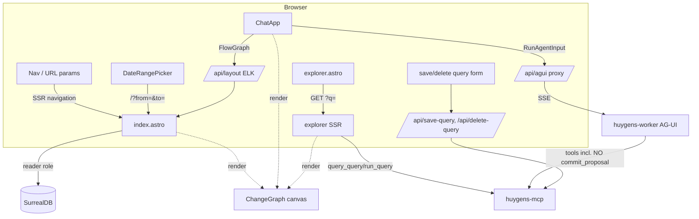

# Huygens · `dashboard-ui` — Functional Specification

> App: **huygens** · Initiative: **dashboard-ui**
> Método: especificación inversa basada en evidencia (skill `reversed-functional-design`),
> estructura canónica de `functional-designer`. Describe el comportamiento real
> **tal y como está implementado** en `apps/dashboard`, no una versión idealizada.

## 1. Summary

`dashboard-ui` es la **superficie visual de escritorio** de Huygens: el lugar donde
Rubén *lee* su memoria estructurada y *conversa* con el agente. Es una aplicación
**Astro renderizada en servidor (SSR)** con islas React (`@astrojs/react`,
`@astrojs/node` en modo standalone), que vive en `apps/dashboard` y se sirve en el
puerto `4321`.

El dashboard ofrece cuatro superficies:

- **`/` (index)** — el espacio de trabajo unificado: un panel de navegación izquierdo
  (Inbox, MITs, Bitácora, Diario, Date review, Borradores) y un lienzo central que
  renderiza el **grafo de cambios** de lo seleccionado, más un panel de **informe** a la
  derecha. La selección viaja en la URL (`?proposal=`, `?day=`, `?view=`, `?from=&to=`),
  de modo que todo es server-rendered y *deep-linkable*.
- **`/explorer`** — un explorador de **SurrealQL de solo lectura**: escribes (o cargas) una
  query, ves los resultados como tabla y, cuando las filas parecen nodos, como grafo.
  Permite guardar y borrar queries con nombre.
- **`/chat`** — la **interfaz conversacional** que hospeda `ChatApp` (assistant-ui sobre
  AG-UI). Un lienzo de grafo a la izquierda muestra las vistas que el agente genera con
  sus tools de exploración; un panel de chat colapsable a la derecha.
- **`/proposals/[id]`** — **redirección permanente** a `/?proposal=<id>` (el detalle de la
  proposal se fusionó dentro de la home unificada).

La frontera funcional de esta iniciativa es **la superficie visual y sus rutas BFF**. El
comportamiento del agente detrás del chat es `conversational-agent-worker`; la semántica
del ciclo de vida de las proposals es `processing-proposals-and-commit`; el modelo del
grafo (tipos/edges/estados) es `graph-model-notes-and-topology`; la semántica de las tools
de recuperación es `retrieval-and-grounding`; el comportamiento ritual/coaching que aflora
en la Bitácora y los nudges es `rituals-and-coaching`.

**Hecho funcional clave de frontera**: el dashboard es, en lo que respecta a la topología
del grafo, **de solo lectura**. No contiene ningún botón ni formulario que invoque
`commit_proposal`, `discard_proposal` ni `set_raw_status`. Las únicas escrituras que el
dashboard ejecuta son sobre artefactos auxiliares (queries guardadas, conversaciones,
layout). Ver §6 y §10 para el detalle de dónde ocurre realmente el commit humano.

## 2. Actors & Roles

| Actor | Tipo | Rol en esta iniciativa |
|---|---|---|
| **Rubén (el usuario)** | Humano, único | Lee su memoria (Inbox, MITs, Bitácora, Diario), explora el grafo, conversa con el agente, guarda/ejecuta queries con nombre, organiza el lienzo. Es **single-user por diseño** (sin auth, sin multi-usuario — ver `docs/UI_STRATEGY.md`). |
| **Agente conversacional (worker)** | Sistema externo | No es un actor *de* la UI sino un servicio que la UI consume. Expone AG-UI en `:7777`; produce texto, tool-calls y vistas de grafo que el lienzo del chat pinta. Detrás de `conversational-agent-worker`. **Excluye `commit_proposal` de su toolset** (`exclude_tools=["commit_proposal"]`). |
| **MCP (`huygens-mcp`)** | Sistema externo | Frontera de persistencia (`:3030/mcp`). El BFF del dashboard llama a sus tools de saved-query y de conversación (`list_queries`, `query_query`, `run_query`, `save_query`, `delete_query`, `list_conversations`, `get_conversation`, `save_conversation`, `delete_conversation`). |
| **SurrealDB** | Sistema externo | BBDD. El dashboard la lee **directamente** (no por el MCP) en SSR, con el rol **`huygens_reader` (VIEWER, solo lectura)** cuando `SURREAL_READER_PASS` está presente (fallback a `root` en dev local). La credencial nunca llega al navegador. |

**Diferencia de rol de lectura**: el dashboard tiene **dos caminos de lectura distintos**.
Las vistas de la home (Inbox, MITs, Bitácora, Diario, proposals) leen **SurrealDB directo**
como `huygens_reader`. El explorer y el chat leen vía **MCP tools** (también solo lectura
en sus caminos: el reader rechaza escrituras). Es una asimetría real del código, no un
detalle de implementación accidental.

## 3. Goals & User Jobs

El objetivo del dashboard, fijado en `docs/UI_STRATEGY.md`, es **no representar la ontología
directamente sino dar superficies estables de workflow**: leer, explorar, conversar y
revisar memoria estructurada. Jobs concretos evidenciados:

1. **Revisar el inbox** — ver las capturas pendientes (`raw_capture` con `status='pending'`)
   en orden FIFO, para saber qué hay por procesar. (Solo lectura: el procesamiento ocurre
   en la conversación con el agente, no con botones aquí.)
2. **Ver el foco del día (MITs)** — leer las *Most Important Tasks* de hoy y las **vencidas**
   (de días pasados, sin cerrar), con su contexto (`part_of` hacia proyecto/área/objetivo y
   sus *blockers* abiertos) pintado como grafo.
3. **Leer la Bitácora** — recorrer cronológicamente los informes rituales (`day` = la jornada,
   `week` = la revisión semanal) agrupados por semana → día, del más reciente al más antiguo,
   como un hilo continuo de markdown.
4. **Navegar el Diario** — explorar los días en los que aterrizaron cambios, desplegar cada
   día a sus proposals committed, y ver el grafo agregado de todo lo que se commiteó ese día.
5. **Revisar una proposal** — abrir una proposal concreta y ver su **grafo de cambios** (lo
   creado/editado + el contexto preexistente) junto a su **informe** (los narrative blocks)
   y un recuento (raws, notas nuevas, updates, edges).
6. **Filtrar por rango de fechas (Date review)** — elegir un rango con un calendario de doble
   mes y ver el grafo agregado de todo lo committed en ese rango.
7. **Conversar con el agente** — chatear en `/chat`; cada tool de exploración que el agente
   ejecuta se convierte en una vista de grafo seleccionable en el lienzo.
8. **Explorar el grafo con SurrealQL** — en `/explorer`, escribir una query de solo lectura y
   verla como tabla o como grafo.
9. **Guardar y reutilizar queries con nombre** — fijar (`pin`) y borrar queries favoritas.
10. **Guardar una conversación** — persistir el hilo de chat actual (mensajes + estado de
    vistas) para retomarlo.

**Jobs NO presentes en esta superficie** (importante por contraste con `docs/UI_STRATEGY.md`,
que describía un `/workbench` con commit por teclado): **commitear, descartar, diferir o
ignorar** desde la UI. El workbench con visual diff editable y atajos `⌘↵`/`⌘⇧D`/`d`/`i`
descrito en la estrategia **no está implementado**; lo que existe es un lector de cambios de
solo lectura. Ver §9.

## 4. Entry Points

### 4.1 Páginas (UI)

| Ruta | Render | Qué sirve |
|---|---|---|
| `/` (`index.astro`) | SSR + islas React | Espacio unificado. Lee `?view=inbox\|mits\|bitacora`, `?day=YYYY-MM-DD`, `?proposal=<id>`, `?from=&to=`. Sin parámetros: placeholder ("Selecciona una proposal, un día… o un rango"). |
| `/explorer` (`explorer.astro`) | SSR + isla React (grafo) | Explorador SurrealQL. Lee `?q=<surql>`, `?saved=<id>`, `?tab=graph`. Query por defecto: proyectos ACTIVE. |
| `/chat` (`chat.astro`) | Isla React `client:only` | Hospeda `ChatApp` (chat + lienzo de vistas del agente). |
| `/proposals/[id]` | SSR redirect 302 | Redirige a `/?proposal=<id>` (o a `/` si no hay id). Compatibilidad de enlaces antiguos. |

### 4.2 Rutas API (BFF / adaptador)

Todas con `prerender = false` (se ejecutan en servidor por petición). Son el *transport*
fino entre la UI y el worker/MCP; no contienen lógica de dominio.

| Endpoint | Método | Función |
|---|---|---|
| `/api/agui` | `POST` | **Proxy same-origin** al endpoint AG-UI del worker (`HUYGENS_AGUI_URL`, por defecto `http://huygens-worker:7777/agui`). Reenvía el `RunAgentInput` del navegador y **devuelve el stream SSE tal cual**. Evita CORS y un puerto público nuevo; la URL del worker nunca llega al navegador. `502` si el worker es inalcanzable. |
| `/api/conversation` | `GET` | Sin `?id`: lista resúmenes de conversaciones (`list_conversations`). Con `?id=`: el hilo completo (`get_conversation`). |
| `/api/conversation` | `POST` | Guarda una conversación (`save_conversation`) con `{ messages[], title?, state?, id? }`. Exige `messages[]`. |
| `/api/save-query` | `POST` (form) | Guarda una query con nombre (`save_query`), con `name`, `query`, `pinned`. Redirige 303 a `/explorer?saved=<id>`. |
| `/api/delete-query` | `POST` (form) | Borra una query (`delete_query`) por `id`. Redirige 303 a `/explorer`. |
| `/api/layout` | `POST` | Calcula el **layout radial ELK** de un `{nodes, edges}` server-side y devuelve nodos/edges posicionados. Lo usa el lienzo del chat para reutilizar el mismo layout que el explorer/proposals (ELK solo corre bajo Node SSR). `400` si el cuerpo no es un grafo válido; `500` si el layout falla. |

### 4.3 Integraciones de lectura (no expuestas como ruta)

- **SurrealDB directo** (SSR, rol `huygens_reader`) para Inbox/MITs/Bitácora/Diario/proposals.
- **MCP HTTP** (`HUYGENS_MCP_URL`, por defecto `http://huygens-mcp:3030/mcp`) para queries y
  conversaciones, vía JSON-RPC `tools/call` parseando la última línea `data:` del SSE.

## 5. Workflows

Numerados para referencia. Cada uno: disparador → pasos → fin, con caminos alternos/error.

### 5.1 Read the Bitácora (la bitácora / diario de jornadas)

**Disparador**: clic en **Bitácora** (`/?view=bitacora`).
**Pasos**: el servidor llama `buildBitacora()`, que proyecta `listInformes()` (proposals
committed cuyo narrative block lleva un `kind`). Las entradas se agrupan **semana → día →
informe**, todas en orden descendente (lo más reciente primero). Cada entrada renderiza su
icono + etiqueta de kind (`☀️ Jornada`, `🔁 Revisión de la semana`; kinds legacy
`plan_day`/`review_day`/`plan_week`/`review_week` siguen renderizando sobre datos históricos)
y el contenido como **markdown** (`<Markdown>`, SSR, cero JS).
**Fin**: el usuario lee su hilo de jornadas.
**Vacío**: placeholder "Bitácora vacía. Las jornadas (`day`) y revisiones semanales (`week`)
aparecerán aquí en cuanto el agente las registre."

### 5.2 Read the MITs (foco del día)

**Disparador**: clic en **MITs** (`/?view=mits`).
**Pasos**: `buildMitView(todayMadrid)` toma `listMits()` (notas con `mit_for` puesto),
selecciona **las de hoy** (día Madrid de `mit_for`) **+ las vencidas** (`day < hoy` y estado
no `DONE`/`ARCHIVED`), añade su contexto (`relatedNoteIds`: ancestros `part_of` hasta 4 saltos
+ *blockers* abiertos), resuelve etiquetas (`resolveNoteCards`) y dibuja un **grafo** con los
MIT marcados como foco (🎯, sólido; vencidos en ámbar "⏰ vencido"). El panel de informe a la
derecha lista cada MIT con su estado, su nota padre y, si los tiene, tags de **vencimiento**
(`⏰ vence` / `🔴 vence` si pasó) y **diferido** (`😴 hasta`).
**Fin**: el usuario ve qué debe hacer hoy.
**Vacío**: placeholder "Sin MITs para hoy. Márcalos con el agente (vía proposal) y aparecerán
aquí." El badge del nav muestra el número de MITs de hoy.

### 5.3 Navigate the Diario and read a committed day

**Disparador**: desplegar **Diario**, o clic en un día (`/?day=YYYY-MM-DD`), o desplegar un día
y elegir una de sus proposals.
**Pasos**: `listDiaryDays()` lista los días con ≥1 proposal committed (agrupados desde
`listCommittedProposalRows`), cada uno con sus proposals anidadas. El nav muestra por día un
**enlace al agregado** (el título del día) y un **botón con el número de proposals** que, al
hover/abierto, muta a un chevron para desplegar la lista. Al elegir un día, `buildDayView(day)`
**fusiona** todas las proposals de ese día en un solo grafo (`fuseProposals`: los temp_ids se
reescriben a las notas reales que produjeron los commits, así una nota creada por una proposal
y enlazada por otra colapsa a un nodo) e hidrata en vivo las relaciones preexistentes (dashed).
El informe muestra los narratives concatenados y el recuento agregado.
**Fin**: el usuario lee todo lo que cambió ese día como una sola imagen.
**Vacío**: "Sin cambios ese día."

### 5.4 Review a single proposal (la revisión de una proposal)

**Disparador**: clic en una proposal (en el Diario o en **Borradores**) → `/?proposal=<id>`;
o navegar a `/proposals/<id>` (redirige).
**Pasos**: `buildProposalView(id)` carga la proposal (`getProposal`). Construye:
- **el grafo de cambios** del payload (ids reales): creates (verde "nuevo"), updates (ámbar
  "editado"), edges semánticos, y nodos de contexto referenciados.
- **el contexto preexistente**: para un **draft** se hidrata contra el grafo en vivo
  (`existingEdgesAmong`); para un **committed** se reconstruye *como estaba al commit* doblando
  el SSOT (`foldTopology` sobre las proposals committed antes) — sin changefeed/VERSION.
- el **informe** (los narrative blocks como markdown) y un **recuento** (raws, +notas, updates,
  edges) con un chip que indica si el contexto es "🕓 contexto del commit" (histórico) o "⟳
  contexto actual" (en vivo).
**Fin**: el usuario entiende qué propone/propuso esa proposal y con qué contexto. **No hay
acción de commit aquí** (ver §6).
**Casos especiales**:
- **Legacy / superseded** (payload con temp_ids, aplanado en el génesis): se renderiza el
  informe pero **no el grafo** (placeholder "Proposal aplanada en el génesis (formato legacy) —
  sin grafo. El informe está a la derecha.").
- **No encontrada**: "Proposal no encontrada."

### 5.5 Filter by date range (Date review)

**Disparador**: clic en **Date review** → abre el `DateRangePicker` (popover de doble mes).
**Pasos**: el usuario elige inicio y fin (con *hover preview* del rango; los días con cambios
llevan un punto). "Aplicar" navega a `/?from=<lo>&to=<hi>`. `buildRangeView(from,to)` fusiona
todo lo committed en el rango inclusivo en un grafo agregado, con su informe y recuento.
"Limpiar" vuelve a `/`.
**Fin**: el usuario ve los cambios de un periodo. **No sustituye al Diario**, es un filtro.
**Vacío**: "Sin cambios en ese rango."

### 5.6 Read the Inbox

**Disparador**: clic en **Inbox** (`/?view=inbox`).
**Pasos**: `listInbox()` trae las `raw_capture` con `status='pending'`, **oldest-first (FIFO)**,
límite 200. Se listan como tarjetas con su `source_kind` y fecha. Solo lectura.
**Fin**: el usuario ve qué tiene por procesar. El badge del nav muestra el conteo.
**Vacío**: "Inbox vacío. Las capturas pendientes (raw_captures sin procesar) aparecerán aquí."

### 5.7 Converse with the agent (chat)

**Disparador**: navegar a `/chat`.
**Pasos**: `ChatApp` crea un `HttpAgent({ url: '/api/agui' })` y un runtime AG-UI
(`useAgUiRuntime`). El usuario escribe en el composer ("Escribe a Huygens…", autofocus) y envía.
El stream del agente (texto + tool-calls) llega vía el proxy `/api/agui`. Para cada **tool de
exploración** (`neighborhood`, `expand_context`, `find_related`, `vector_search`, `query_query`,
`run_query`) se renderiza un **chip compacto** ("🔎 <tool> · N nodos → canvas") en lugar de JSON
crudo, y su resultado se adapta a un `FlowGraph` (`toolResultToFlow`) que se registra como
**vista seleccionable** y se activa en el lienzo. El lienzo pide el layout a `/api/layout` y
pinta `ChangeGraph`. El `ViewSelector` (chips superiores) deja cambiar entre vistas. El chat es
**colapsable** (botón `›`/`‹`); por defecto abierto.
**Guardar**: el botón "Guardar conversación" exporta los mensajes del hilo y el estado de vistas
y los `POST`ea a `/api/conversation`; muestra "Guardando…/Guardada/Error N".
**Fin**: deliberación conversacional con vistas curadas.
**Sin vistas**: "El agente aún no ha generado vistas. Pídele que explore tu grafo."
**Error de layout**: "layout: <mensaje>".

### 5.8 Explore with SurrealQL (`/explorer`)

**Disparador**: navegar a `/explorer` (query por defecto precargada) o cargar una guardada.
**Pasos**: el usuario escribe SurrealQL en el `textarea` y pulsa **Run** (`GET /explorer?q=…`).
La query se ejecuta de solo lectura vía MCP (`query_query` ad-hoc, o `run_query` si es
guardada). Los resultados se muestran como **Tabla** (siempre, hasta 200 filas, columnas =
unión de claves). Si las filas parecen nodos (`resultsToFlow`: filas de edges reales o
inferencia de campos anidados), aparece la pestaña **Grafo**, que pinta `ChangeGraph` con el
layout ELK.
**Guardar query**: el formulario lateral (nombre + `pinned`) hace `POST /api/save-query`.
**Borrar query**: la ✕ junto a cada favorita hace `POST /api/delete-query`.
**Fin**: inspección directa del grafo por query (el "menú" en un grafo no jerárquico).
**Error**: el `<pre class="err">` muestra el mensaje de SurrealDB; el contador marca "⚠ error".
**Vacío**: "Sin resultados."

### 5.9 Interact with the change graph (lienzo)

Transversal a 5.2–5.5, 5.7–5.8. Sobre cualquier `ChangeGraph`:
- **Arrastrar nodos** (React Flow gestiona el drag; las posiciones iniciales son del layout
  radial ELK servidor).
- **Leyenda interactiva** (`GraphLegend`, panel flotante abajo-derecha, colapsable): documenta
  el encoding y permite **togglear** por **tipo de nota**, por **estado ZTD**, por **kind de
  relación**, y mostrar/ocultar las **relaciones preexistentes** (hidratadas). Togglear no
  reposiciona: solo oculta nodos/edges (las posiciones no saltan).
- **Abrir bloques descriptivos**: clic en un nodo con bloques descriptivos abre el
  `DescriptiveModal` (overlay con el markdown de sus bloques; cierra con Escape o backdrop).
- **Etiqueta de relación**: el nombre del edge aparece solo al *hover* ~0,9 s sobre él
  (`FloatingEdge`); el resto del tiempo el kind se transmite por color/grosor.

## 6. Functional Rules & Constraints

### 6.1 Frontera de mutación (el hecho central)

- **El dashboard NO muta la topología del grafo.** No existe en `apps/dashboard` ninguna
  invocación de `commit_proposal`, `discard_proposal` ni `set_raw_status`, ni botón/formulario
  que las dispare (verificado por búsqueda exhaustiva). El detalle de proposal es **solo
  lectura**: badge de estado + informe (markdown) + recuento. No hay "Commit", "Discard",
  "Defer" ni "Ignore".
- **El agente tampoco commitea**: el worker excluye `commit_proposal` de su toolset
  (`exclude_tools=["commit_proposal"]`, `agent.py`). Es la garantía humano-en-el-bucle de
  ADR-0026: "el commit al grafo es una acción explícita de Rubén".
- **Dónde ocurre el commit humano**: la doctrina (ADR-0026, `docs/UI_STRATEGY.md`, los
  comentarios del worker) afirma que el commit es **una acción humana explícita**. Pero el
  **dónde físico** de esa acción **no está evidenciado en `apps/dashboard`**: ninguna página ni
  ruta del dashboard la ofrece. En la implementación actual, Rubén invoca `commit_proposal`
  contra el MCP **fuera de este dashboard** (p. ej. desde un cliente MCP directo). Ver §10,
  *Open Questions*, donde se recoge la discrepancia con el framing de la iniciativa.
- **Escrituras que sí ejecuta el dashboard** (todas sobre artefactos auxiliares, no topología):
  guardar/borrar **queries con nombre** (`save_query`/`delete_query`), guardar **conversaciones**
  (`save_conversation`), y calcular **layout** (cómputo, no escritura). Las lecturas SurrealDB
  van como `huygens_reader` (VIEWER); cualquier escritura por ese camino la rechaza la BBDD.

### 6.2 Reglas de render del grafo de cambios

- **Provenance de nodo**: `created` → badge "nuevo" + borde sólido; `updated` → "editado";
  `context` (referenciado, sin cambios) → dashed + atenuado; un nodo **MIT** → 🎯 sólido a plena
  opacidad (precede a la provenance); MIT **vencido** → acento ámbar "⏰ vencido"; nota **DONE**
  → atenuada pero con borde sólido.
- **Encoding de edge por kind**: `part_of` = columna estructural (grueso, índigo, **sólido**, y
  es lo que dirige el layout radial); `blocked_by` = dependencia (rojo, medio); `mentions` =
  débil (gris fino); fallback gris. Las relaciones **preexistentes/hidratadas** se dibujan
  **dashed + atenuadas** para distinguirlas de las que la proposal crea.
- **Layout**: radial ELK server-side, raíz = la jerarquía `part_of` (un nodo sin padre es raíz;
  con varias raíces se añade un super-root invisible para que los componentes no se solapen).
  `mentions`/`blocked_by` son overlays, fuera del cálculo de posición.

### 6.3 Selección y estado

- **La selección es navegación SSR** (vía URL), no estado de cliente. Los toggles de los
  drawers del nav son puramente visuales (clase `open`). Solo `?proposal`/`?day`/`?view`/
  `?from&to` cambian el contenido renderizado.
- **Precedencia de vistas** en la home: `bitacora` > `mits` > `proposal` > `day` > `range`.
  Activar una vista de panel (`?view=…`) anula la selección de día/proposal.
- **Estado de filtros del grafo** (`GraphViewContext`): se inicia con todo visible y
  `showHydrated=true`. Vive en React, no en la URL: se pierde al recargar.

### 6.4 Bucketing temporal

- Los días se bucketean por el **día local de Madrid** (DST-correcto): `todayMadridDay()` y la
  expresión SQL `MADRID_DAY` desplazan el instante por el offset de Madrid antes de tomar la
  fecha. Sin `committed_at` (commits pre-result) se usa `updated_at`.

### 6.5 Robustez / errores

- **Lecturas best-effort**: la home carga Inbox, MITs, días y nudges con `try/catch` que
  degradan en silencio (panel vacío) si fallan; solo `listProposals` y la construcción de la
  vista activa propagan error visible (`listError`/`viewError`).
- **Reconexión SurrealDB**: el cliente SSR vive días; un fallo recuperable (auth perdida, socket
  caído) reconecta un cliente fresco y reintenta una vez (`resilient` proxy).
- **AG-UI inalcanzable**: `/api/agui` devuelve `502` con el mensaje; el chat lo refleja.

### 6.6 Responsive

- La UI es **desktop-first**. En `< 820px` la home colapsa a un nav off-canvas (hamburguesa +
  backdrop) y un toggle segmentado **Dividir / Grafo / Informe** para ver solo una de las dos
  zonas. La estrategia (`docs/UI_STRATEGY.md`) declara la captura móvil como **otro cliente**,
  no esta UI.

## 7. Data Concepts (nivel UI)

Conceptos que el usuario percibe en la interfaz (no el esquema físico de la BBDD; ese es
`graph-model-notes-and-topology`).

- **Vista (canvas view)** — una imagen del grafo en el lienzo. En la home es la proposal/día/
  rango/MITs seleccionados; en el chat es el resultado de una tool del agente (una entrada del
  `ViewSelector`); en el explorer es la query convertida a grafo.
- **Grafo de cambios (ChangeGraph)** — el lienzo React Flow: tarjetas de nodo (`CardNode`) +
  edges flotantes (`FloatingEdge`) + leyenda (`GraphLegend`). Renderiza nodos posicionados por
  ELK; transmite provenance (nuevo/editado/contexto/MIT/vencido/DONE) y kind de relación.
- **Informe** — el panel derecho con los **narrative blocks** (markdown) de la proposal/día/
  rango, más un **recuento** (raws, notas nuevas, updates, edges) y el chip de contexto
  (histórico vs en vivo). En la home, es la pieza de "interpretación".
- **Bitácora** — el lector cronológico de informes rituales (`day`/`week`), semana → día →
  entrada, como hilo de markdown.
- **Diario** — la lista navegable de días con cambios, cada día desplegable a sus proposals
  committed y enlazable a su grafo agregado.
- **MITs** — la lista del foco del día (hoy + vencidos) con estado, padre y tags temporales,
  con su grafo de contexto.
- **Inbox** — la lista de capturas pendientes (FIFO), solo lectura.
- **Borradores** — la sección del nav con las proposals `status='draft'` (viven fuera de
  cualquier día committed). Es lo más cercano al "límite de revisión" antes del commit, pero su
  detalle sigue siendo **solo lectura**.
- **Date review** — el filtro de rango de fechas (calendario doble mes).
- **Saved query** — una query SurrealQL con nombre, opcionalmente fijada (`pinned`), gestionada
  desde el explorer.
- **Conversación guardada** — un hilo de chat persistido (mensajes + estado de vistas).
- **Vista de tabla (explorer)** — las filas de una query como tabla genérica (columnas = unión
  de claves, ids normalizados a `tabla:id`).
- **Nudge ritual** — un banner de invitación (no un artefacto) que aparece cuando no hay jornada
  de hoy, o cuando es domingo/lunes y no hubo revisión semanal en 7 días. Comportamiento detrás
  de `rituals-and-coaching`.

**Estados percibidos**:
- *Estado de proposal* (badge): `draft` (ámbar), `committed` (verde), `discarded` (gris),
  `superseded` (azul).
- *Estado ZTD de nota* (color de punto en la leyenda y de borde): `CLARIFIED`, `ACTIVE`,
  `WAITING`, `SOMEDAY`, `DONE`, `ARCHIVED`.
- *Provenance de nodo*: nuevo / editado / contexto / MIT / vencido / DONE.

## 8. Graphical Representation

Reconstruida a partir de las pantallas reales (`index.astro`, `explorer.astro`, `chat.astro`,
los componentes de `graph/` y `chat/`). Tema **claro** (`color-scheme: light`; nótese que
`docs/UI_STRATEGY.md` proponía dark — la implementación es light), tipografía `system-ui`,
azul de acento `#2f54eb`.

### 8.1 Home `/` — espacio unificado (estado: proposal seleccionada)

```
┌──────────────────────────────────────────────────────────────────────────────────┐
│ Huygens                                                                            │
├───────────────────────┬───────────────────────────────────┬──────────────────────┤
│ NAV (280px, fijo)     │  CANVAS (flex)                    │  INFORME (360px)     │
│                       │                                   │                      │
│ 📥 Inbox        [3]   │   ┌ nudge (si aplica) ─────────┐  │  [committed] note:...│
│ 🎯 MITs         [2]   │   │ ☀️ No hay jornada de hoy…  │  │                      │
│ 📖 Bitácora           │   └────────────────────────────┘  │  Informe             │
│ 📓 Diario        ▾    │                                   │  ──────────────────  │
│   • 24 jun     (3)>   │        ●project "Govoy"           │  (narrative blocks   │
│     ▸ informe…        │       ╱   sólido part_of           │   como markdown)     │
│   • 23 jun     (1)    │   ●task ──── ●task                 │                      │
│ 📅 Date review   ▸    │   "nuevo"   "editado"             │  ⟳ contexto actual   │
│ 📝 Borradores   [1]   │   (leyenda flotante ▾)            │  3 raw  +2 notas     │
│   • borrador…         │                       ┌─Leyenda─┐ │  1 updates  4 edges  │
│                       │            [Controls] │ Nodos…  │ │                      │
│                       │                       │ Estado… │ │                      │
│                       │                       │ Relac…  │ │                      │
│                       │                       └─────────┘ │                      │
└───────────────────────┴───────────────────────────────────┴──────────────────────┘
```

- **NAV**: secciones como acordeones. *Inbox*/*MITs* muestran un badge de conteo. *Diario* y
  *Borradores* despliegan listas; cada día tiene enlace al agregado + botón-número de proposals.
  *Date review* es el trigger del calendario. Item activo en azul (`.on`).
- **CANVAS**: el `ChangeGraph`; si no hay selección, un placeholder centrado. Los nudges flotan
  arriba-centro.
- **INFORME**: solo presente con proposal/día/rango/MITs; badge de estado + narratives + chips
  de recuento. **Sin botones de acción.**

Modo *Inbox* y modo *Bitácora* sustituyen el par canvas+informe por un único artículo a ancho
de lectura (lista de capturas / hilo de jornadas).

### 8.2 Tarjeta de nodo (`CardNode`) y leyenda

```
        ┌───────────────────────────┐         Leyenda (colapsable):
  (icono●)│  Título de la nota        │ (badge●)  Nodos:  ●task Tarea  ●project Proyecto …
        │  • state → ACTIVE          │           Estado: ●ACTIVE ●WAITING …
        │  • mit → 2026-06-25        │           Relac.: ── part_of  ── blocked_by  ·· mentions
        │  📄 ver 2 bloques          │           Trazo:  ▢ creado/editado  ▢(dashed) contexto
        └───────────────────────────┘                   ☑ Relaciones preexistentes
```

- Chip de **tipo** (icono lucide en color) en la esquina superior izquierda; **badge de
  provenance** ("nuevo"/"editado"/"🎯 MIT"/"⏰ vencido") arriba-derecha. Líneas de cambio (state,
  mit, etc.) como bullets. Pie "ver N bloques" si hay descriptivos (clic → modal).
- La **leyenda** togglea tipos, estados, kinds y "relaciones preexistentes"; cada fila tachada +
  atenuada cuando está off.

### 8.3 Chat `/chat`

```
┌───────────────────────────────────────────────┬──────────────────────────────┐
│ CANVAS (1fr)                              ‹/›  │ CHAT (380px, colapsable)     │
│  ┌ ViewSelector ───────────────────────────┐  │  ┌ thread ────────────────┐  │
│  │ (neighborhood · 12) (vector_search · 5)  │  │  │           tú ▸ procesa │  │
│  └──────────────────────────────────────────┘  │  │  agente ◂ veo dos …     │  │
│                                                 │  │  🔎 neighborhood · 12   │  │
│        (grafo de la vista activa,               │  │     nodos → canvas      │  │
│         vía /api/layout → ChangeGraph)          │  └─────────────────────────┘  │
│                                                 │  [Guardar conversación] estado│
│  "El agente aún no ha generado vistas.          │  ┌ composer ──────────────┐  │
│   Pídele que explore tu grafo."                 │  │ Escribe a Huygens…  [▸]│  │
└───────────────────────────────────────────────┴──┴─────────────────────────┘──┘
```

- Dos columnas reales (canvas 1fr + chat 380px). El **toggle `›`/`‹`** colapsa el chat a 0.
- Cada tool de exploración → **chip** en el hilo + entrada en el **ViewSelector**; la vista
  activa se pinta en el canvas. Mensajes usuario (azul, derecha) / asistente (gris, izquierda).
- Barra **Guardar conversación** sobre el composer.

### 8.4 Explorer `/explorer`

```
┌────────────────────────────────────────────────────────────────────────────────┐
│ ← proposals   explorer · SurrealQL                                               │
├──────────────────┬─────────────────────────────────────────────────────────────┤
│ Guardadas (250px)│ ┌ qbar ─────────────────────────────────────────────┐        │
│  ★ proyectos  ✕  │ │ SELECT * FROM note WHERE …            [textarea] [Run]      │
│  pendientes   ✕  │ └────────────────────────────────────────────────────┘       │
│                  │  Tabla | Grafo                         12 fila(s) · 8 nodos   │
│ Guardar query    │ ┌────────────────────────────────────────────────────┐       │
│  [Nombre…]       │ │ id        │ title          │ type     │ state       │       │
│  ☐ fijar         │ │ note:abc  │ Revisar Govoy  │ project  │ ACTIVE      │       │
│  [Guardar]       │ │ …         │ …              │ …        │ …           │       │
└──────────────────┴────────────────────────────────────────────────────────────┘
```

- *Run* re-renderiza por GET. **Tabla** siempre; **Grafo** solo si las filas son grafables.
  Lateral: favoritas (★ si fijadas, ✕ borra) y formulario de guardado.

### 8.5 Date review (popover del calendario)

```
                ┌──────────── Date review ────────────┐
                │  ‹   junio 2026      julio 2026   ›  │
                │  L M X J V S D    L M X J V S D      │
                │  … día con punto = tiene cambios …   │
                │  (rango resaltado; endpoint en azul) │
                │  desde 3 jun → hasta 12 jun          │
                │              [Limpiar]  [Aplicar]    │
                └──────────────────────────────────────┘
```

### 8.6 Interaction model (resumen)



## 9. Restrictions & Tradeoffs

- **No hay workbench de procesamiento con commit.** `docs/UI_STRATEGY.md` describía un
  `/workbench` de tres zonas (inbox + visual diff editable + chat) con `commit`/`discard`/
  `defer`/`ignore` por teclado y edición Tiptap de los narrative blocks. **Nada de eso está
  implementado.** Lo entregado es un **lector de cambios de solo lectura** + chat + explorer.
  El visual diff verde/amarillo editable y los atajos `⌘↵`/`⌘⇧D`/`d`/`i` **no existen**.
- **El detalle de proposal es read-only** y la ruta `/proposals/[id]` es solo un redirect: el
  detalle vive embebido en la home.
- **Tema claro, no oscuro** (la estrategia proponía dark por defecto).
- **Sin paleta de comandos (`⌘K`)**, sin `/search` híbrido dedicado, sin `/note/[id]` (los
  bloques descriptivos se ven en un modal desde el grafo, no en una página de nota).
- **Sin auth / single-user**: la lectura es como `huygens_reader`; sin sesiones de usuario ni
  multi-tenant.
- **Dos caminos de lectura** (SurrealDB directo para la home; MCP para explorer/chat) — eficaz,
  pero una asimetría a tener presente (la home no pasa por la frontera MCP para leer).
- **Estado de filtros del grafo no persistente** (vive en React, se pierde al recargar).
- **Explorer limitado a 200 filas** en tabla; el grafo depende de que la query devuelva edges
  reales o campos anidados inferibles.
- **Móvil degradado**: solo colapsos básicos; la captura móvil es explícitamente otro cliente.
- **Acoplamiento de presentación al vocabulario actual**: los registros de estilo (`styles.ts`)
  hardcodean tipos (`task`, `project`, `objetivo`, …), kinds (`part_of`, `blocked_by`,
  `mentions`) y estados ZTD — al contrario del principio de la estrategia de no hardcodear el
  vocabulario en componentes. Tipos/kinds desconocidos caen a un fallback.

## 10. Open Questions & Assumptions

- **[Discrepancia con el framing de la iniciativa] ¿Dónde invoca el humano `commit_proposal`?**
  El brief de esta iniciativa pide afirmar que "**`commit_proposal` es invocado por el humano
  desde esta UI**". **No evidenciado en `apps/dashboard`**: no hay botón, formulario ni ruta que
  lo invoque (búsqueda exhaustiva: `commit_proposal` no aparece en el código del dashboard). Lo
  que sí está evidenciado y es coherente con la doctrina (ADR-0026, `docs/UI_STRATEGY.md`,
  `agent.py`): (a) el commit es **humano**, no del agente (el worker lo excluye); (b) el
  dashboard es de **solo lectura** sobre la topología. Conclusión documentada: en la
  implementación actual el commit humano ocurre **fuera de este dashboard** (cliente MCP directo,
  `commit_proposal` contra `huygens-mcp`). **Pregunta abierta**: ¿es un estado transitorio (falta
  el botón de commit en la home) o una decisión deliberada de que el dashboard nunca mute? El
  código no lo resuelve.
- **Asunción**: "la Bitácora" es el lector cronológico de informes rituales (`day`/`week`),
  evidenciado por `bitacoraView.ts` y la sección `📖 Bitácora`. El brief la equipara a
  "diary/MITs"; en la implementación, **Bitácora** (informes rituales) y **Diario** (días con
  cambios committed) son **dos superficies distintas** con datos distintos. Lo he documentado
  como tales.
- **No evidenciado**: si las conversaciones guardadas se **vuelven a cargar** en el chat. Existen
  `GET /api/conversation` y `getConversation`, pero `ChatApp` no llama a esos endpoints para
  rehidratar un hilo (solo guarda). La carga de una conversación previa no está cableada en la UI.
- **No evidenciado**: cualquier flujo de captura (`capture()`) desde el dashboard. El Inbox solo
  **lista** pendientes; la captura entra por otros clientes (la estrategia lo confirma).
- **Asunción de despliegue**: `HUYGENS_AGUI_URL`, `HUYGENS_MCP_URL`, `SURREAL_READER_PASS` y el
  dominio `huygens.nexolabs.dev` (allowedHosts) provienen del entorno; en dev local el reader cae
  a `root`. Tomado de `astro.config.mjs`, `surreal.ts`, `queries.ts`, `agui.ts`.
